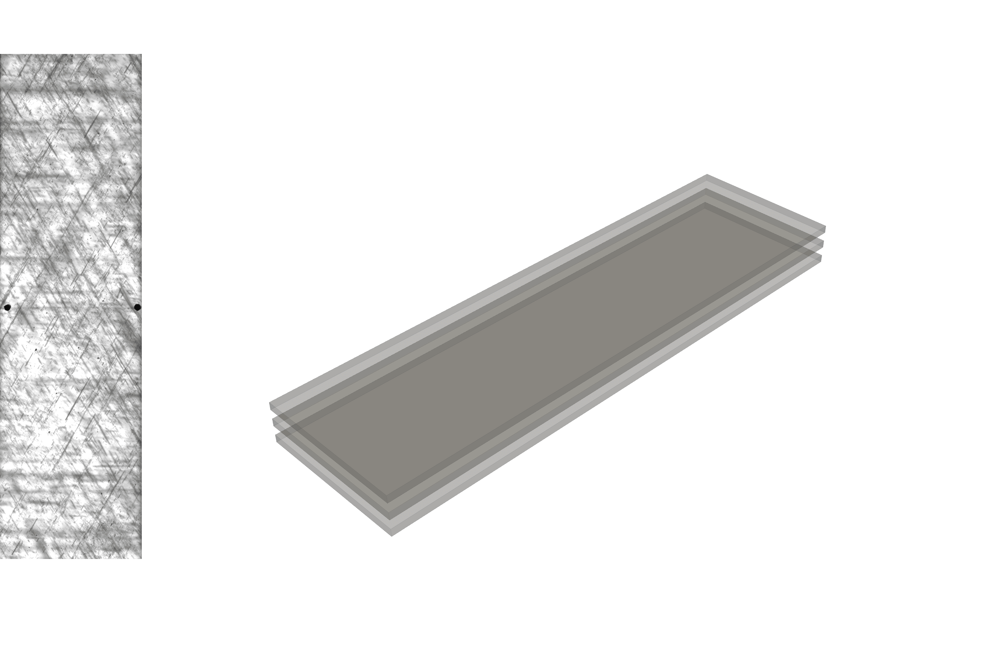

<p align="center">
  
</p>


<p align="center">
  <a href="https://deladect.readthedocs.io">Documentation</a>
  ·
  <a href="https://github.com/VascoPires/DelaDect">Repository</a>
</p>

<p align="center">
  
</p>

DelaDect is a Python package for quantitative damage analysis in optical image stacks of fiber-reinforced polymers.

## Installation

DelaDect supports `Python >= 3.9`, with `Python 3.10` recommended.

Install from source:

```bash
git clone https://github.com/VascoPires/DelaDect.git
cd DelaDect
pip install
```

## Prerequisites

Dependencies are installed automatically via `pip`. The key requirements are:

- [CrackDect](https://github.com/mattdrvo/CrackDect) 0.2
- scikit-image 0.18+
- NumPy >= 1.19
- SciPy 1.6+
- Matplotlib >= 3.3
- SQLAlchemy 1.3+
- Numba 0.52+
- psutil 5.8+

## Quick Start

For a full first run including delamination detection and save/reload flows, start with the [Getting Started guide](https://deladect.readthedocs.io/en/latest/examples/getting_started.html).

## Shift Correction

The package also included a shift-distortion correction for the image stack preparation before any analysis. It is assumed that the images provided to DelaDect have already been properly shift-corrected, as this represents a fundamental step of the methodology.

```bash
shift_correction --help
```

Including


## Repository Layout

```text
src/deladect/         Core package
  cli/                shift_correction entry point
  detection/          Crack and delamination detection
  io/                 Save/load utilities
  specimen.py         Specimen and laminate metadata model
  utils.py            Image and geometry helpers
docs/                 Sphinx documentation
docs/source/_static/   Sphinx static assets (logo, gif, css)
pyproject.toml        Packaging and dependency configuration
```

## Authors And License

DelaDect is maintained by Vasco D. C. Pires.

Licensed under the AGPL-3.0 License. See `LICENSE` for details.
