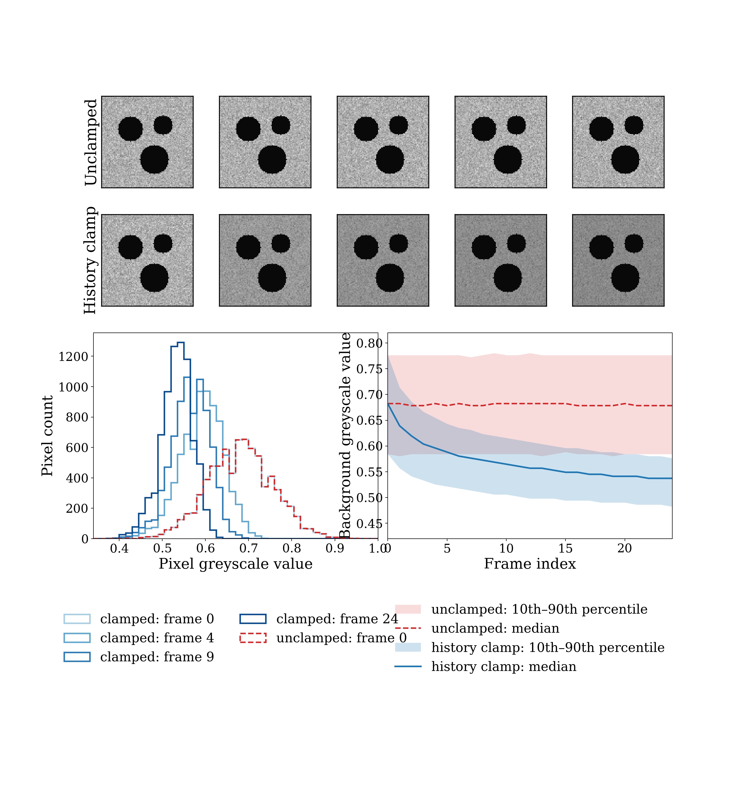

Normalization
=====================

Overview
--------
A specimen is photographed repeatedly over the course of a test, and those
raw frames are affected by noise such as lighting drifts slightly between shots, 
shadows, reflections flicker on and off, and the
undamaged material never looks perfectly uniform to begin with. So, if a
detector just looked at how *dark* a pixel is, it couldn't tell "this got
darker because it delaminated" apart from "this got darker because the
lighting changed." This page shows how the pre-processing
(or normalization) in DelaDect solves that. There are two mechanisms that
help negate the already mentioned issues which are applied in order:

1. **History clamp**: suppresses transient bright noise and reflections.
2. **Reference normalization**: a ratio against a baseline frame, so new
   damage stands out relative to that baseline instead of absolute
   brightness.

DelaDect does this once per image stack, before any crack or delamination
detector runs, via
:meth:`~deladect.detection.delamination.DelaminationDetector.preprocess_stack_to_disk`.

.. note::

   This is separate from (and runs before) the per-slice filtering used by
   the detectors themselves. See :doc:`methodology`'s "Detection
   sequence" for an example (directional grey-opening, unsharp mask,
   directional Gaussian smoothing, shown pixel-by-pixel in
   :doc:`image_operations`). This page covers the stack-wide step that
   conditions raw frames before any detector runs.

.. currentmodule:: deladect.detection.delamination

History clamp
--------------
A stray reflection or a speck of dust can make a pixel flash bright for a
single frame and then go back to normal. That's noise and it
should be ignored. The history clamp does this by remembering, for every
pixel, the darkest value it has *ever* reached so far, and forcing the
current frame down to that darkest-so-far value: ``min(current_frame, history)``.
A pixel only stays dark in the output once it has *actually* gone dark and
stayed that way across frames. 

This is on by default (``history_clamp=True``) and controlled by
``history_mode``: ``"running"`` remembers the darkest value over the
*entire* stack so far, while a rolling window only looks back
``history_window_size`` frames. The second one would only be needed
in very specific conditions where very obvious shadows show up (from a hand
or some other factor) and the user doesn't wish to keep a full history
of the ImageStack. Nevertheless, for most cases, the full history clamp
is the most suitable.

Bender et al. [Bender2021]_ use the same idea for crack detection in
white-light imaging: without a clamp, per-frame noise stays flat forever while
with the running clamp, it plateaus as history accumulates.

The figure below shows this on a small synthetic image stack with noise, using
DelaDect's own ``apply_minimum_history``: unclamped vs. clamped image.
It is also seen the background pixel-value histograms 
getting narrower and shifting to the darker side over time. 

Reference normalization
------------------------
After the history clamp, each frame is compared to a **baseline** (a
reference image of what the specimen looked like before) by dividing one by
the other, pixel by pixel: ``current / baseline``. Where nothing has
changed, that ratio is close to 1 (unchanged brightness), where the specimen
has darkened relative to the baseline, the ratio drops below 1.

.. image:: _static/normalization/frame_division_ratio.png
   :alt: Static reference normalization by frame division
   :width: 960
   :align: center

This idea is done by :func:`_normalize_reference_frame` 
(with a safeguard against dividing by zero) and the ratio clipped
back to ``0-255``:

.. code-block:: python

   denominator = np.maximum(baseline_float, 1e-3)
   ratio = np.clip(frame_float / denominator, 0.0, 1.0)
   processed = (ratio * 255.0).astype(np.uint8)

However the most important decision is
 *which frame counts as the baseline* since damage is compared
 to that baseline. This can be selected by choosing a ``reference_mode``:

- ``"static"`` (default): one fixed first frame, reused for the whole
  stack. Standard for :meth:`EdgeDetector.detect_primary`,
  :meth:`DelaminationDetector.detect_both_delaminations`, and
  :meth:`DiffuseDetector.diffuse_delamination`. It is fairly robust
  since the background and initial damage is removed from the image
  and only new damage shows up as dark pixels.
- ``"rolling_median"``: an adaptive baseline built from the median of a
  window of recent frames, ``[start_idx, end_idx)`` where
  ``end_idx = idx - reference_skip`` and ``start_idx = end_idx - reference_window``.
  This method is mandatory :meth:`EdgeDetector.detect_edge_multi`, 
  however it can also be selected for one interface delamination.

Static-reference limits and the rolling alternative
^^^^^^^^^^^^^^^^^^^^^^^^^^^^^^^^^^^^^^^^^^^^^^^^^^^^
A fixed baseline works well as long as the baseline frame itself still looks
"healthy" (undamaged, or close to it).

.. warning::

   A static baseline works in the majority of cases, however, as reported
   by Olesen et al. [Olesen2024]_, using a more recent baseline (rolling-median)
   can assist with better damage recognition, especially when the 
   specimens become severely damaged.

``reference_mode="rolling_median"`` uses the pixelwise median of several
recent frames instead, so the baseline stays current. 

With ``reference_window=1`` this behaves as a simple lagged single-frame
reference: ``reference_skip=0`` uses frame ``n-1`` as baseline,
``reference_skip=1`` uses ``n-2``, and so on. 

.. image:: _static/normalization/rolling_median_reference.png
   :alt: Rolling median reference normalization from previous frames
   :width: 960
   :align: center

For a concrete comparison of both modes on a real specimen and frame,
rather than the schematic above, see the normalization step in
:doc:`examples/delamination_multi_interface`.

API: ``preprocess_stack_to_disk``
----------------------------------
.. code-block:: python

   detector.preprocess_stack_to_disk(
       stack,
       key="edge_primary_auto_0/90",
       max_frames=None,
       history_mode="running",
       history_window_size=None,
       reference_mode="static",
       reference_window=10,
       reference_skip=0,
       cache_dirname="Preprocessor_cache",
       progress=False,
   )

References
----------

.. [Bender2021] Bender, J. J., Bak, B. L. V., Jensen, S. M., & Lindgaard, E.
   (2021). Effect of variable amplitude block loading on intralaminar crack
   initiation and propagation in multidirectional GFRP laminate.
   *Composites Part B: Engineering*, 217, 108905.
   `<https://doi.org/10.1016/j.compositesb.2021.108905>`_

.. [Olesen2024] Olesen, A. M., Bak, B. L. V., Bender, J. J., & Lindgaard, E.
   (2024). MatrixCraCS: Automated tracking of matrix crack development in
   GFRP laminates undergoing large tensile strains.
   *Composites Science and Technology*, 253, 110638.
   `<https://doi.org/10.1016/j.compscitech.2024.110638>`_

