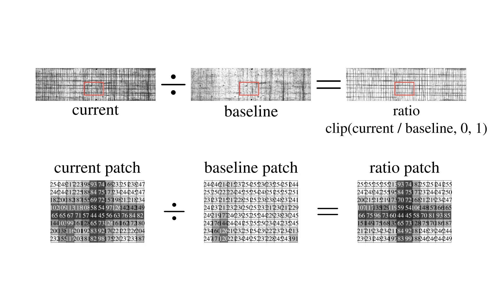
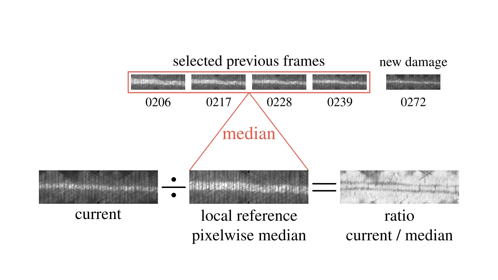

Normalization
=====================

Overview
--------
A specimen is photographed repeatedly over the course of a test, and those
raw frames are noisy in ways that have nothing to do with damage: lighting
drifts slightly between shots, reflections flicker on and off, and the
undamaged material never looks perfectly uniform to begin with. If a
detector just looked at how *dark* a pixel is, it couldn't tell "this got
darker because it delaminated" apart from "this got darker because the
lighting changed." Normalization solves that: it compares every frame
against a reference so only genuinely new, persistent darkening comes
through.

DelaDect does this once per image stack, before any crack or delamination
detector runs, via
:meth:`~deladect.detection.delamination.DelaminationDetector.preprocess_stack_to_disk`.

.. note::

   This is separate from (and runs before) the per-slice filtering described
   in :doc:`methodology`'s "Algorithm summary" (directional grey-opening,
   unsharp mask, directional Gaussian smoothing) -- this page covers the
   stack-wide step that conditions raw frames, not a specific detector's own
   filter chain.

Two mechanisms are applied per frame, in order:

1. **History clamp** — suppresses transient bright noise/reflections.
2. **Reference normalization** — a ratio against a baseline frame, so new
   damage stands out relative to that baseline instead of absolute
   brightness.

.. currentmodule:: deladect.detection.delamination

History clamp
--------------
A stray reflection or a speck of dust can make a pixel flash bright for a
single frame and then go back to normal — that's noise, not damage, and it
should be ignored. The history clamp does this by remembering, for every
pixel, the darkest value it has *ever* reached so far, and forcing the
current frame down to that darkest-so-far value: ``min(current_frame, history)``.
A pixel only stays dark in the output once it has *actually* gone dark and
stayed that way across frames; a one-frame flicker gets overwritten by the
next frame's clamp and disappears.

This is on by default (``history_clamp=True``) and controlled by
``history_mode`` (``"running"`` — remembers the darkest value over the
*entire* stack so far — or a rolling window that only looks back
``history_window_size`` frames).

Reference normalization
------------------------
After the history clamp, each frame is compared to a **baseline** (a
reference image of what the specimen looked like before) by dividing one by
the other, pixel by pixel: ``current / baseline``. Where nothing has
changed, that ratio is close to 1 (unchanged brightness); where the specimen
has darkened relative to the baseline, the ratio drops below 1. Because it's
a *ratio* rather than a raw brightness difference, slow, shared lighting
drift between the current frame and the baseline cancels out automatically
-- what's left over is dominated by genuinely new, persistent darkening.

In code (:func:`_normalize_reference_frame`, implementation detail), the
same idea with a small safeguard against dividing by zero and the ratio
clipped back into a normal ``0-255`` image range:

.. code-block:: python

   denominator = np.maximum(baseline_float, 1e-3)
   ratio = np.clip(frame_float / denominator, 0.0, 1.0)
   processed = (ratio * 255.0).astype(np.uint8)

The only real question is *which frame counts as the baseline* --
``reference_mode`` selects that:

- ``"static"`` (default) — one fixed early frame, reused for the whole
  stack. Standard for :meth:`EdgeDetector.detect_primary`,
  :meth:`DelaminationDetector.detect_both_delaminations`, and
  :meth:`DiffuseDetector.diffuse_delamination`.
- ``"rolling_median"`` — an adaptive baseline: the median of a trailing
  window of recent frames, ``[start_idx, end_idx)`` where
  ``end_idx = idx - reference_skip`` and ``start_idx = end_idx - reference_window``.
  Reserved for :meth:`EdgeDetector.detect_edge_multi`.

Static-reference limits and the rolling alternative
^^^^^^^^^^^^^^^^^^^^^^^^^^^^^^^^^^^^^^^^^^^^^^^^^^^^
A fixed baseline works well as long as the baseline frame itself still looks
"healthy" -- undamaged, or close to it.

.. warning::

   **Self-canceling reference behavior.** Late in a test, the "healthy
   baseline" assumption stops being true: if the baseline frame is far in
   the past, by the current frame the specimen may already be damaged in
   the *same* spot the baseline was taken from. Since both the current
   frame and the baseline are now dark there, the ratio between them comes
   out close to 1 again -- as if nothing were there. The damage has
   effectively canceled itself out of its own reference frame. This
   specifically breaks **multi-interface promotion** (``detect_edge_multi``),
   which depends on still detecting *further* change inside a region that's
   already damaged.

The fix is to stop pinning the baseline to one fixed frame in the past and
instead let it track close to "now": ``reference_mode="rolling_median"``
uses the pixelwise median of several recent frames as the baseline, so it
keeps up with the specimen instead of getting left behind. Recommended
settings for ``detect_edge_multi``:

- ``reference_mode="rolling_median"``
- ``reference_skip >= 1``

With ``reference_window=1`` this behaves as a simple lagged single-frame
reference: ``reference_skip=0`` uses frame ``n-1`` as baseline,
``reference_skip=1`` uses ``n-2``, and so on. ``detect_edge_multi``'s
auto-preprocessing path defaults to ``reference_window=10``,
``reference_skip=1`` when neither is supplied.

For a concrete, code-generated comparison of both modes on the same real
specimen and frame -- rather than the schematic above -- see
:doc:`examples/delamination_multi_interface`'s "Static vs. rolling-median
preprocessing, on this data" section.

API: ``preprocess_stack_to_disk``
----------------------------------
.. code-block:: python

   detector.preprocess_stack_to_disk(
       stack,
       key="edge_primary_auto_0/90",
       max_frames=None,
       history_mode="running",
       history_window_size=None,
       reference_mode="static",
       reference_window=10,
       reference_skip=0,
       cache_dirname="Preprocessor_cache",
       progress=False,
   )

Returns ``{"cache_paths": [...]}``, one path per processed frame. Each
cached ``.npz`` lives at ``<results>/<cache_dirname>/<key>/preprocess_%04d.npz``
and stores:

- ``processed`` — the normalized frame
- ``baseline`` — the baseline frame used for that index
- ``ref_start_idx``, ``ref_end_idx``, ``ref_anchor_idx`` — the resolved
  reference window bounds
- ``reference_mode``, ``reference_window``, ``reference_skip``,
  ``history_mode``, ``history_window_size`` — the settings used, so the
  cache is self-describing

A manifest file in the same cache directory records the run's settings for
reuse across detectors.

Choosing a mode in practice
-----------------------------

.. grid:: 1 1 2 2
   :gutter: 2

   .. grid-item-card:: Single interface
      :class-card: sd-border-success

      Running :meth:`EdgeDetector.detect_primary`, diffuse detection, or
      combined edge+diffuse on a single interface: the
      ``reference_mode="static"`` default is normally fine.

   .. grid-item-card:: Multi-interface promotion
      :class-card: sd-border-warning

      Running :meth:`EdgeDetector.detect_edge_multi`: use
      ``reference_mode="rolling_median"`` with ``reference_skip >= 1``, per
      the self-canceling-reference warning above.

.. note::

   If diffuse masks look too broad (rectangular ROI-like shapes), see the
   troubleshooting order in :doc:`detection`'s "Troubleshooting" section --
   ``reference_skip`` is the first knob to try there too.

