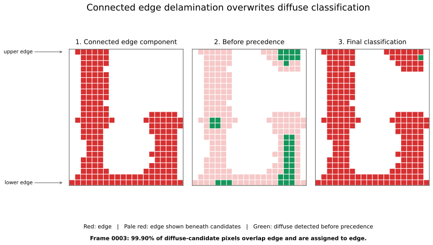

Delamination API Reference
==========================

For conceptual explanations and animations, see :doc:`edge_delamination` and
:doc:`diffuse_delamination`. This page collects the shared API, combined
classification, and parameter reference.

Overview
--------
Delamination detection is provided by the class-based
:class:`deladect.detection.delamination.DelaminationDetector` workflow.

The API is organized around one detector instance per ``(specimen, interface)`` pair:

- preprocessing helpers (history clamp + reference normalization)
- edge delamination (:meth:`EdgeDetector.detect_primary`)
- diffuse delamination (:meth:`DiffuseDetector.diffuse_delamination`)
- combined arbitration (:meth:`DelaminationDetector.detect_both_delaminations`)
- hierarchical edge promotion across multiple interfaces
  (:meth:`EdgeDetector.detect_edge_multi`)

Edge and diffuse detection are exposed as peer sub-detectors reached via
``detector.edge`` and ``detector.diffuse`` respectively; shared infrastructure
(preprocessing, caching, combined arbitration) lives directly on
``DelaminationDetector``.

.. currentmodule:: deladect.detection.delamination

Core classes
------------

.. autosummary::
   :toctree: generated

   DelaminationDetector
   EdgeDetector
   DiffuseDetector

Algorithm summary
-----------------

Primary edge detection
^^^^^^^^^^^^^^^^^^^^^^
For each frame, the edge workflow:

1. Splits into upper/lower halves (lower is flipped internally).
2. Applies directional morphology + unsharp + Gaussian smoothing.
3. Thresholds to a binary candidate map.
4. Reconstructs an edge-connected snapshot from a shallow top seed region.
5. Latches detections frame-to-frame.

Diffuse detection (crack-guided)
^^^^^^^^^^^^^^^^^^^^^^^^^^^^^^^^^
Diffuse detection uses crack segments to define local ROIs and computes a single
threshold per frame from the union of ROI values. It then segments each ROI and
accumulates masks over time.

When preprocessed cache metadata is available, diffuse crack-frame selection can
be aligned to the normalization reference window (for example midpoint or latest
reference frame) instead of always using same-frame cracks.

Post-threshold cleanup uses binary closing (dilation then erosion) to fill small
holes and bridge narrow gaps.

Combined edge + diffuse
^^^^^^^^^^^^^^^^^^^^^^^
Combined detection runs both pipelines, resolves overlaps in favour of edge
delamination, and can apply an edge-exclusion halo (``edge_exclusion_px``).
Reported fractions are decimal values in ``[0, 1]``.

Full-image comparison: connected edge regions
"""""""""""""""""""""""""""""""""""""""""""""
This section describes a separate, intentionally unconstrained full-image
experiment; it is not output from the split-region :doc:`examples/getting_started`
run. In that comparison, frame 0003 illustrates a classification limitation
that occurs when edge detection is run on the full image rather than
constrained to explicit upper and lower regions. Delamination growing inward
from the upper and lower specimen boundaries has connected into one edge-mask
component. That component touches both boundaries and also occupies part of
the specimen middle, where diffuse delamination may physically be present.

The combined workflow resolves overlap with edge precedence: a diffuse
candidate is classified exclusively as edge wherever the masks overlap. In
the unconstrained comparison, 26,032 of 26,058 diffuse-candidate pixels
(99.90 percent) overlap the edge-exclusion mask. Only 26 diffuse pixels
survive in the complete frame. By contrast, the verified split-region
Getting Started run produces 662,041 diffuse candidates, 5,327 overlapping
pixels (0.80 percent), and 656,714 surviving diffuse pixels for frame 0003.
The square-cell diagram below shows the unconstrained mask relationship over
the full specimen height in a representative 600-pixel-wide region.

   Sample-1 frame 0003, shown as 30-by-30-pixel square cells over the full
   specimen height. Panel 1 isolates the edge component that touches both the
   upper and lower boundaries. Panel 2 shows diffuse candidates as green
   vertical stripes over the pale-red edge mask. In panel 3, those stripes are
   red because edge precedence overwrites the overlapping diffuse label.

This demonstrates ambiguity in the classification rule, not proof of the
physical damage class at every pixel. Once edge regions connect through the
middle, DelaDect cannot represent coexisting edge and diffuse labels there.
The explicit region configuration used by the Getting Started example avoids
that specific failure mode by preventing the edge detector from evaluating
the middle rows.

Multi-interface edge progression
^^^^^^^^^^^^^^^^^^^^^^^^^^^^^^^^^
``detect_edge_multi`` promotes damage across an ordered interface list
(``interfaces=[i0, i1, i2, ...]``):

- level 1 is primary edge damage
- level ``k+1`` must come from level ``k`` candidates
- promotion is gated by similarity and persistence
- terminal-frame promotion is supported (default)

This workflow follows the legacy workbook logic while exposing a cleaner API
for multi-interface runs.

Recommended preprocessing for multi-interface runs
--------------------------------------------------
``detect_edge_multi`` requires preprocessed input and logs a reminder when called.

Recommended settings:

- ``reference_mode="rolling_median"``
- ``reference_skip >= 1``

This helps avoid self-canceling reference behavior during promotion.
For detailed guidance on static-reference limits and rolling alternatives, see
:doc:`Image_pre_processing`.

Overlay helper for saved masks
------------------------------
When combined mask bundles already exist on disk, you can regenerate individual
views without rerunning detection:

.. code-block:: python

    detector.save_delamination_overlay(frame_idx=12, overlay_type="edge")
    detector.save_delamination_overlay(frame_idx=12, overlay_type="diffuse")
    detector.save_delamination_overlay(frame_idx=12, overlay_type="both")
    detector.save_delamination_overlay(frame_idx=12, overlay_type="total_dela")

Typical workflows
-----------------

Primary edge only
^^^^^^^^^^^^^^^^^

.. code-block:: python

    from deladect.detection import DelaminationDetector

    detector = DelaminationDetector(specimen, interface)
    edge_result = detector.edge.detect_primary(
        processed_cache_paths=cache_paths,
        save_overlays=True,
        overlay_view="both",
        debug=True,
    )
    edge_masks, edge_debug = edge_result["masks"], edge_result["debug"]

Diffuse only
^^^^^^^^^^^^

.. code-block:: python

    diffuse_result = detector.diffuse.diffuse_delamination(
        cracks=cracks,
        processed_cache_paths=cache_paths,
        save_overlays=True,
        debug=True,
    )
    diffuse_masks, diffuse_debug = diffuse_result["masks"], diffuse_result["debug"]

Combined edge + diffuse
^^^^^^^^^^^^^^^^^^^^^^^

.. code-block:: python

    result = detector.detect_both_delaminations(
        cracks=cracks,
        processed_cache_paths=cache_paths,
        edge_exclusion_px=5,
        overlay_view="classified",
        save_masks=True,
        save_metrics=True,
        return_masks=False,
    )

    metrics = result["metrics"]

Multi-interface edge progression
^^^^^^^^^^^^^^^^^^^^^^^^^^^^^^^^^

.. code-block:: python

    multi = detector.edge.detect_edge_multi(
        interfaces=specimen.interfaces,
        processed_cache_paths=primary_cache_paths,
        secondary_cache_paths=rolling_cache_paths,
        save_masks=True,
        save_overlays=True,
        secondary_params={
            "secondary_similarity_threshold": 0.6,
        },
    )

Key parameter groups
--------------------

Edge primary parameters (``detect_primary(params=...)``)
^^^^^^^^^^^^^^^^^^^^^^^^^^^^^^^^^^^^^^^^^^^^^^^^^^^^^^^^^^
- ``window_edge=(0, 60)``
- ``threshold_strategy="kmeans"``
- ``gaussian_filters=(0.5, 15.0)``
- ``scale_min=None``, ``scale_max=None`` (percentile-based scaling is the
  default; set both explicitly to switch to fixed-bound scaling)
- ``seed_ratio=0.01``
- ``connectivity_mode="directional"`` (also supports strict ``"columnwise"``;
  the former ``"legacy_flood"`` mode was removed)
- ``directional_lateral_drift_px=None`` (explicit horizontal drift per row)
- ``directional_lateral_drift_scale=0.25`` (used when ``*_px`` is ``None``)
- ``hard_floor=0.90`` (normalized gate on smoothed image; tweak per specimen)
- ``post_threshold_closing_px=4`` (pixel-radius closing; this is the active
  default -- takes precedence over ``post_threshold_closing_scale`` whenever set)
- ``post_threshold_closing_scale=None`` (optional size-relative closing,
  scaled by ``avg_crack_width_px``; only used when ``post_threshold_closing_px``,
  ``post_threshold_closing_radius``, and ``pre_threshold_closing_radius`` are
  all ``None``)
- ``post_threshold_closing_radius`` (optional explicit override; ``0`` disables closing)
- ``pre_threshold_closing_radius`` (legacy alias for explicit closing radius)
- ``min_object_px=0`` (remove small connected components after closing)

Diffuse parameters (``detector.diffuse.diffuse_delamination(params=...)``)
^^^^^^^^^^^^^^^^^^^^^^^^^^^^^^^^^^^^^^^^^^^^^^^^^^^^^^^^^^^^^^^^^^^^^^^^^^
- ``diffuse_dx=20.0``, ``diffuse_dy=20.0``
- ``crack_frame_policy in {"current", "reference_latest", "reference_midpoint"}``
- ``threshold_max_samples=200000``
- ``threshold_downsample=2``
- ``window_diffuse=(0, 60)``
- ``gaussian_filters=(0.5, 15.0)``
- ``scale_min=150.0``, ``scale_max=255.0`` (used as fixed scaling bounds)
- ``scale_min_percentile=10.0``, ``scale_max_percentile=99.0``
  (when both are set, per-ROI percentiles override fixed bounds)
- ``hard_floor=0.90`` (normalized gate on diffuse-smoothed ROI; tweak per specimen)
- ``post_threshold_closing_px=4`` (pixel-radius closing; this is the active
  default -- takes precedence over ``post_threshold_closing_scale`` whenever set)
- ``post_threshold_closing_scale=None`` (optional size-relative closing,
  scaled by ``avg_crack_width_px``; only used when ``post_threshold_closing_px``
  is ``None``)

How the filtering parameters work
^^^^^^^^^^^^^^^^^^^^^^^^^^^^^^^^^^
``window_edge`` and ``window_diffuse`` are ``(wy, wx)`` sizes for a rectangular
neighbourhood. For each frame, the image is passed through a maximum filter
followed by a minimum filter, both using that same window -- a grayscale
morphological *closing*. This bridges small gaps between nearby bright pixels
and smooths the detected front, without growing its overall extent the way a
maximum filter alone would.

Making one dimension of the window much larger than the other (the default
``(0, 60)``, or ``(1, 60)`` as used in :doc:`examples/getting_started`) makes
the closing directional: gaps are bridged along the wide axis while the
narrow axis is left almost untouched. This reconnects a broken delamination
front running along that axis without merging separate, unrelated features
stacked in the other direction. A square window instead closes gaps evenly in
both directions, which suits more localized damage rather than an elongated
front. Larger windows bridge bigger gaps and produce a smoother, more
connected result, but can also merge genuinely separate damage regions
together and blur their boundaries; smaller windows preserve fine detail but
may leave a real, continuous front fragmented into disconnected pieces.

``diffuse_dx`` and ``diffuse_dy`` set the half-extent, in pixels, of the
rectangular region of interest built around each crack segment for diffuse
detection. A smaller ROI restricts the search to damage immediately adjacent
to a crack; a larger ROI captures diffuse damage further from the crack but
raises the chance of picking up unrelated background or neighbouring cracks'
damage.

``seed_ratio`` is the fraction of the *split-half* slice height (not the
whole-image pixel count) trusted as the initial seed region for edge-connected
reconstruction: ``seed_depth = round(seed_ratio * height)`` rows starting from
the specimen edge. Detections in that shallow seed band are assumed genuine
and used to grow the rest of the connected edge-damage region frame to frame.
A ratio of ``0.01`` seeds from the first 1% of rows in each half; raising it
trusts a deeper region as ground truth (useful if the true edge front starts
further in), while lowering it restricts seeding to a thinner, more
conservative band.

Hard-floor notes
^^^^^^^^^^^^^^^^
- Glud/Bender-style crack pipelines commonly use a strict threshold near ``0.96`` in their processed domain.
- For delamination segmentation in this repository, ``0.90`` is the current practical default in recent tuning.
- You can override ``hard_floor`` independently for edge and diffuse in your study registry or per-run params.

For a lagged single-frame rolling reference, use preprocessing
``reference_mode="rolling_median"`` with ``reference_window=1`` and tune
``reference_skip`` for lag depth.

Diffuse troubleshooting (practical order)
-----------------------------------------
If diffuse masks look too broad (for example rectangular ROI-like masks), tune
in this order:

1. increase preprocessing ``reference_skip`` (start with ``1`` or ``2``)
2. reduce ``post_threshold_closing_px`` (for example ``4 -> 2``); it's the
   active default and takes precedence over ``post_threshold_closing_scale``
3. tighten ROI geometry (``diffuse_dx``, ``diffuse_dy``)
4. retune ``window_diffuse`` and threshold sampling controls

For repeatable troubleshooting on sample-1, see:

- ``notebooks/sample1_diffuse_threshold_troubleshooting.ipynb``
- ``notes/sample1_benchmark_protocol.md``

Multi-interface promotion parameters (``detect_edge_multi(params=...)``)
^^^^^^^^^^^^^^^^^^^^^^^^^^^^^^^^^^^^^^^^^^^^^^^^^^^^^^^^^^^^^^^^^^^^^^^^^^
- ``secondary_similarity_threshold=0.6``
- ``min_primary_frac_for_secondary=0.0``
- ``secondary_start_frame=None``

Use ``processed_cache_paths`` for static-reference primary detection and
``secondary_cache_paths`` for rolling-median secondary detection.

Output layout
-------------

Combined edge + diffuse
^^^^^^^^^^^^^^^^^^^^^^^
- overlays: ``results/<specimen>/<overlay_dirname>/both/overlays/``
- masks: ``results/<specimen>/<overlay_dirname>/both/<masks_dirname>/``
- metrics: ``results/<specimen>/<overlay_dirname>/both/metrics/frame_metrics.csv``

Multi-interface edge
^^^^^^^^^^^^^^^^^^^^
- overlays: ``results/<specimen>/<overlay_dirname>/edge_multi/overlays/``
- masks: ``results/<specimen>/<overlay_dirname>/edge_multi/<masks_dirname>/``
  containing ``<interface>_inclusive.npz`` and ``<interface>_exclusive.npz``

Figure placeholders you can add
-------------------------------
The following figure slots mirror CrackDect-style documentation and are useful
for review decks. Create them under ``docs/source/_static/delamination/`` and
insert them with ``.. figure::``.

1. ``pipeline_overview.png``
   - one-page flow: preprocessing -> edge/diffuse -> overlap arbitration -> outputs
2. ``edge_primary_step_panels.png``
   - raw, filtered, binary, latched primary mask
3. ``diffuse_roi_threshold.png``
   - one frame showing crack ROIs and the per-frame diffuse threshold
4. ``combined_classified_overlay.png``
   - edge (red) + diffuse (green) classified overlay
5. ``multi_interface_levels.png``
   - level map for i0/i1 in distinct colors

Related example
---------------
See :doc:`examples/delamination_multi_interface` for a complete sample-4 walkthrough.
See :doc:`results_storage` for bundle names and metadata path keys.

API details are available in the autogenerated pages under ``docs/source/generated``.
