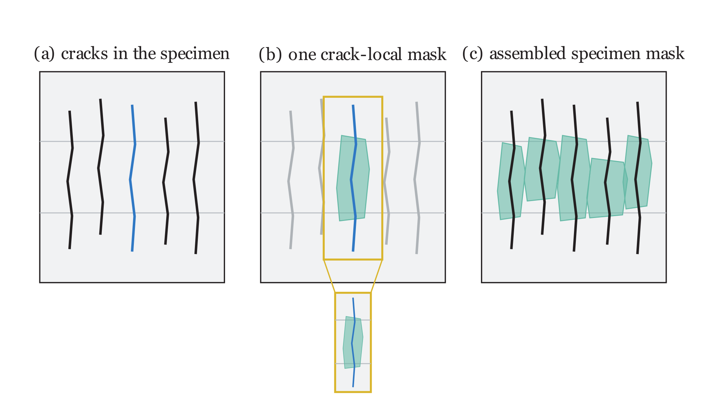

Diffuse Delamination
====================

Diffuse delamination is assembled crack by crack. The virtual example below
shows the idea without depending on a particular experiment. For each crack
in the specimen, DelaDect creates a local delamination mask around that crack
and places the mask back at the crack's position in the full image.

   Virtual example of the assembly. One crack produces one local mask.
   Repeating this for every crack and combining the projected masks produces
   a single specimen-sized mask.

The full mask is the logical union of the individual crack masks. A pixel is
therefore classified as diffuse delamination when it belongs to at least one
projected crack-local mask.

Running diffuse detection
-------------------------

Diffuse detection needs a configured specimen and interface, together with
the cracks detected in each frame. The detector returns one assembled,
full-frame mask per frame.

.. code-block:: python

   from deladect.detection import DelaminationDetector, crack_analysis

   cracks = crack_analysis(specimen, save_cracks=True)
   detector = DelaminationDetector(specimen, interface)

   diffuse_result = detector.diffuse.diffuse_delamination(
       cracks=cracks,
       save_overlays=True,
       params={
           "diffuse_dx": 40.0,
           "diffuse_dy": 10.0,
           "window_diffuse": (30, 30),
       },
       progress=True,
   )

   diffuse_masks = diffuse_result["masks"]

The parameter values are measured in pixels and should be matched to the
image scale:

- ``diffuse_dx`` is the half-width of the local region perpendicular to a
  crack.
- ``diffuse_dy`` extends the local region beyond both crack ends.
- ``window_diffuse`` sets the row-by-column feature scale used by the diffuse
  detector.

If the supplied crack coordinates refer to the full image rather than the
specimen's middle-region image, pass ``crack_coordinate_space="full"`` to
``diffuse_delamination``.

Using the assembled masks
-------------------------

Masks are Boolean arrays keyed by frame name. Their shape matches the full
specimen image, so they can be displayed, measured, or saved directly.

.. code-block:: python

   import numpy as np

   frame_key = sorted(diffuse_masks)[-1]
   mask = diffuse_masks[frame_key]

   area_px = np.count_nonzero(mask)
   area_mm2 = area_px / specimen.scale_px_mm**2

   np.savez_compressed("diffuse_masks.npz", **diffuse_masks)

See :class:`~deladect.detection.delamination.DiffuseDetector` for the complete
method signature and optional settings.
