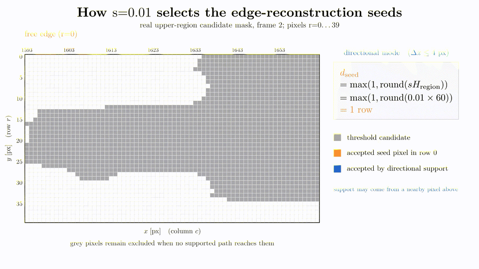
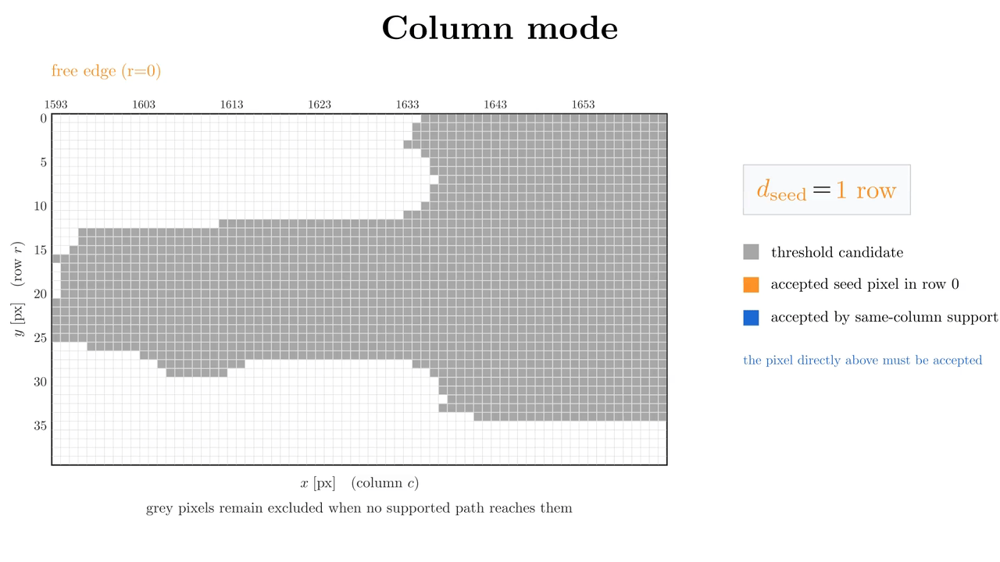

Edge Delamination
=================

Edge delamination is damage that remains connected to a specimen free edge.
The upper and lower specimen halves are processed independently; the lower
half is flipped so that the relevant free edge is row zero in both cases.

Detection sequence
------------------

For each frame, :meth:`deladect.detection.delamination.EdgeDetector.detect_primary`
applies filters, unsharp masking, directional Gaussian
smoothing, constant scaling, thresholding, and morphological closing,
shown pixel-by-pixel on the :doc:`image_operations` page. Free-edge
reconstruction and frame-to-frame accumulation follow, described below.

Free-edge reconstruction
------------------------

Thresholding alone can produce isolated dark regions away from the edge.
Both reconstruction modes reject isolated regions. ``"directional"`` accepts
a candidate when the preceding row contains an accepted pixel within the
configured horizontal drift range. The drift is a tolerance: a value of three
permits support from any accepted pixel within ``+-3`` columns.
``"columnwise"`` is stricter: only the pixel directly above in the same column
can provide support. Empty rows cannot be jumped in either mode. The removed
``legacy_flood`` mode is no longer available.

The animations below use the same real threshold-candidate crop and seed row,
so the effect of the connectivity rule can be compared directly. Pixel
coordinates follow the image convention ``[row, col] = [y, x]``: columns and
``x`` run horizontally, while rows and ``y`` run vertically.

   **Directional connectivity.** Growth proceeds row by row, and an accepted
   pixel in the preceding row may provide support within the displayed
   horizontal :math:`\Delta x` tolerance.

   **Columnwise connectivity.** Growth still proceeds row by row, but support
   must come from the pixel directly above in the same column
   (:math:`\Delta x = 0`).

Frame-to-frame latching
-----------------------

The accepted mask is combined with the previous mask using a logical OR.
Previously detected edge damage is therefore retained while newly connected
damage is added. Where edge and diffuse classifications overlap, the combined
workflow assigns the shared pixels to edge delamination.

Key parameters
--------------

- ``seed_ratio`` controls the depth of the initial free-edge seed.
- ``connectivity_mode`` supports ``"directional"`` and ``"columnwise"``.
- ``directional_lateral_drift_px`` explicitly sets horizontal drift per row.
- ``directional_lateral_drift_scale`` derives drift from average crack width
  when no explicit pixel value is supplied.
- ``post_threshold_closing_radius`` controls binary closing.
- ``hard_floor`` provides an additional normalized intensity gate.

See :doc:`detection` for the full API reference, including default values.

Detecting damage at more than one interface, in laminates with more than two
plies, is covered separately in :doc:`multi_interface_delamination`.
