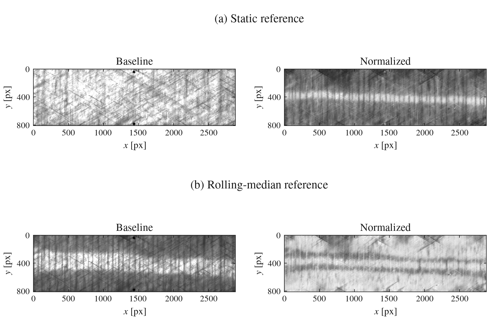
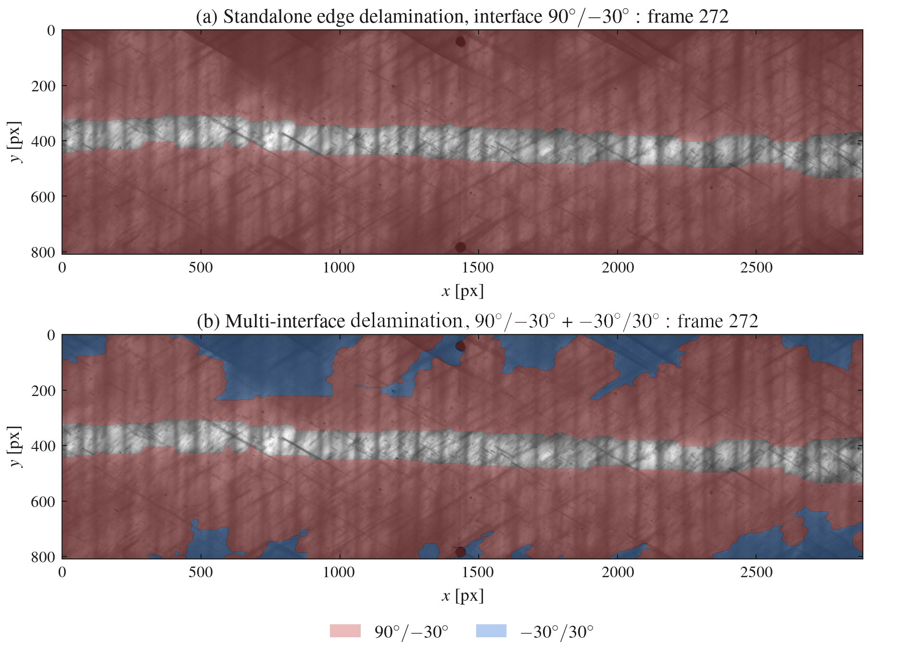
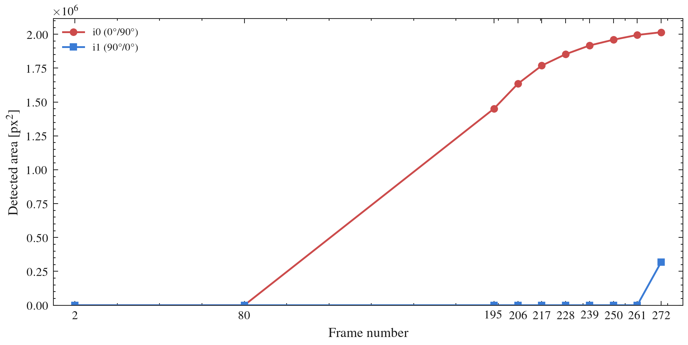

02 - Multi-Interface Edge Delamination
======================================

In the first example, the fundamentals of DelaDect were covered. For that example,
the specimen had a single interface where delamination detection was performed. However,
DelaDect also offers the possibility to perform delamination detection across multiple interfaces.

This functionality is only available for edge delamination detection for specimens such as the one
shown in Sample-3 (see provided examples). Since from a single image it is only possible to obtain a distribution
of intensity, it is not possible to distinguish between delamination at different interfaces. However,
if the history of the frame is provided through a sequence of images, it is possible to detect delamination
at one interface and then, if additional delamination is detected in the same region in subsequent images,
delamination on a different layer can be detected.

.. note::

   This approach is built on the assumption that any additional darkening in
   the same region is due to delamination at a different interface, and it
   is only valid when delamination shows up sequentially during a
   mechanical test with one interface dominant in the initial stages. This
   is often the case for laminates such as :math:`[\pm \theta /90^\circ]_s`,
   but it is an assumption, not something the algorithm verifies.

Due to the complex nature of this approach, this example is divided into three parts. 
The first part shows how different normalization
of the images in a sequence can be performed and it is the most important step of this analysis, 
here we will see the differences between using the static
reference and the rolling median reference. The second part shows how to perform delamination detection
on a single interface. Finally, the third part shows how to perform delamination detection on multiple
interfaces.

A `Binder <https://mybinder.org/v2/gh/vascodcpires/deladect/main?labpath=notebooks/multi_interface_edge_delamination.ipynb>`_
notebook that serves as a companion to this example is available in the
repository and can be run without installation.

Building the specimen
----------------------

Multi-interface delamination needs at least two interfaces, so this specimen has
three ply directions: 90, -30, 30 (symmetric) and two interfaces: ``90/-30`` between the first two
plies, and ``-30/30`` between the last two. ``90/-30`` is what we call the primary interface, since it
is the first interface to show delamination, while ``-30/30`` is the secondary interface.
As seen before for the :doc:`getting started <getting_started>` example, the specimen can be built by:

.. code-block:: python

   from pathlib import Path

   from deladect.detection import DelaminationDetector
   from deladect.io import save_specimen
   from deladect.io.delamination import save_mask_bundle
   from deladect.specimen import Specimen

   specimen = Specimen(
       name="02-multi-interface-edge",
       scale_px_mm=41.03328366,
       path_full="example_images/sample-3",
       sorting_key="_sc",
       image_types=["png"],
       avg_crack_width_px=8.0,
   )
   for index, orientation in enumerate((90.0, -30.0, 30.0)):
       specimen.add_ply(
           name=f"ply_{index}",
           orientation_deg=orientation,
           avg_crack_width_px=8.0,
           min_crack_length_px=20.0,
       )
   specimen.add_interface(name="90/-30", upper_ply=0, lower_ply=1)
   specimen.add_interface(name="-30/30", upper_ply=1, lower_ply=2)

   detector = DelaminationDetector(
       specimen,
       specimen.interfaces[0],
       save_preprocess_outputs=True,
   )

Plies are numbered outward from the interface where delamination initiates
first: ``90/-30`` is the primary interface, ``-30/30`` the secondary one.
``DelaminationDetector`` is constructed against ``specimen.interfaces[0]``
(``90/-30``), the primary interface used by the standalone run in the next
section.

.. tip::

   For a standard :math:`[\pm \theta]_s` or :math:`[\pm \theta /90^\circ]_s`
   layup where the exact ply order doesn't need to be pinned down,
   :meth:`~deladect.specimen.Specimen.from_plus_minus` builds the plies and
   interfaces in one call instead of the explicit ``add_ply``/``add_interface``
   loop above.

1. Normalization (pre-processing)
-----------------------------------
The first and most important step of the multi-interface methodology is the
normalization stage, since it is this stage that decides whether new damage
on a deeper interface can be told apart from the already-established primary
front -- see :doc:`../Image_pre_processing` for the general static-vs-rolling-median
background. The snippet below builds the two preprocessing caches used later
in this example: a static-reference cache for the primary accumulation, and a
rolling-median-reference cache for the deeper-interface check. The figure shows the
*baseline* each reference mode computes and the resulting *processed* frame,
at the last sampled frame.

.. code-block:: python

   # static reference: fixed baseline, drives the primary (90/-30) accumulation
   primary_cache = detector.preprocess_stack_to_disk(
       specimen.image_stack_full,
       key="primary_static",
       reference_mode="static",
   )["cache_paths"]

   # rolling-median reference: recent baseline, drives the -30/30 deeper-interface check
   secondary_cache = detector.preprocess_stack_to_disk(
       specimen.image_stack_full,
       key="secondary_rolling",
       reference_mode="rolling_median",
       reference_window=7,
       reference_skip=2,
   )["cache_paths"]

   Sample-3, frame 272. **(a)** the static baseline is fixed to the first
   frame, so it never "absorbs" the delamination front. So the normalized
   frame only shows one high-contrast band. **(b)** The
   rolling-median baseline (window=7, skip=2) tracks recent frames, so it
   partially absorbs the already-established front into the baseline itself.
   This means that the normalized frame is now sensitive to the new damage
   happening on a different layer (which lead to the darkening).

2. Standalone edge delamination
--------------------------------

:meth:`~deladect.detection.delamination.EdgeDetector.detect_primary` runs
entirely on its own -- no crack catalogue, no diffuse pipeline, and no second
interface required. This is the same edge algorithm used inside
``detect_both_delaminations``, just called directly on ``90/-30``.

.. code-block:: python

   primary_only = detector.edge.detect_primary(
       save_overlays=True,
       overlay_dirname="edge_only",
       params={
           "window_edge": (1, 130),
           "gaussian_filters": (0.5, 15.0),
           "hard_floor": 0.90,
           "scale_min_percentile": 10,
           "scale_max_percentile": 95,
           "seed_ratio": 0.01,
           "post_threshold_closing_px": 20,
       },
   )

   # exports the masks (used later in the 3D visualization)
   primary_only_masks_path = save_mask_bundle(
       primary_only["masks"],
       specimen.results_dir("edge_only", "edge", "masks") / "primary.npz",
   )

``detect_primary`` doesn't save masks by itself (only overlays, when
requested); the snippet above saves the returned masks explicitly with
``save_mask_bundle`` so they persist alongside the overlays.

3. Multi-interface detection
------------------------------

:meth:`~deladect.detection.delamination.EdgeDetector.detect_edge_multi` checks
for new damage inside a previously delaminated area. If new damage is found
inside the parent interface's mask, it is attributed to the next, deeper
interface.

This method needs two separate preprocessing caches: a *static*-reference
cache drives the primary accumulation at ``90/-30``, while a
*rolling-median*-reference cache drives the deeper-interface check at ``-30/30``.
The same pattern extends to deeper hierarchies: a candidate on a third
interface can only be attributed once it is also covered by the established
mask of the interface directly above it.

.. code-block:: python

   # multi-interface delamination across both interfaces
   multi_result = detector.edge.detect_edge_multi(
       interfaces=specimen.interfaces,
       processed_cache_paths=primary_cache,
       secondary_cache_paths=secondary_cache,
       save_masks=True,
       save_overlays=True,
       primary_params={
           "window_edge": (1, 130),
           "gaussian_filters": (0.5, 15.0),
           "hard_floor": 0.90,
           "scale_min_percentile": 10,
           "scale_max_percentile": 95,
           "seed_ratio": 0.01,
           "post_threshold_closing_px": 20,
       },
       secondary_edge_params={
           "window_edge": (1, 30),
           "gaussian_filters": (0.5, 15.0),
           "hard_floor": 0.90,
           "scale_min_percentile": 10,
           "scale_max_percentile": 95,
           "seed_ratio": 0.01,
           "post_threshold_closing_px": 10,
       },
       secondary_params={
           "secondary_similarity_threshold": 0.80,
           "min_primary_frac_for_secondary": 0.10,
           "secondary_start_frame": 2,
       },
   )

   manifest = specimen.results_dir("config") / "specimen.json"
   save_specimen(specimen, manifest)

   **(a)** Standalone ``detect_primary`` on ``90/-30`` alone. **(b)** The same
   frame from ``detect_edge_multi``: ``90/-30`` unchanged, plus ``-30/30``
   attributed wherever the rolling-median pass found further change inside the
   settled ``90/-30`` region.

   Detected area per interface across the sampled frames.

``secondary_params`` controls when new damage is attributed to the deeper interface:

- ``secondary_start_frame`` is the only setting that currently changes the
  result: frames before this index (here, index 2) produce no
  secondary output, which is useful when a specimen has a known dwell
  period before deeper damage can occur.
- ``secondary_similarity_threshold`` and ``min_primary_frac_for_secondary``
  are accepted and validated but are not yet wired into the per-frame
  attribution decision -- don't rely on either to change output today.

For the full attribution mechanics -- how a candidate is attributed to a
deeper interface, and exactly what each ``secondary_params`` setting does and doesn't affect --
see :doc:`../multi_interface_delamination`. Saving ``manifest`` here lets this specimen
be reloaded later together with its stored results, as described in
:doc:`../results_storage`.

.. _multi-interface-3d:

The specimen in 3D
--------------------

A good way to visualize the results is through a 3D visualization tool such as PyVista. Here
the detected masks are saved and can be shown in 3D, such as in the example below.

.. raw:: html

   <label style="display: inline-flex; align-items: center; gap: 0.4em; margin-bottom: 0.5em;">
     <input type="checkbox" id="sample3-3d-cracks-toggle">
     Show cracks
   </label>
   

     <iframe id="sample3-3d-with-cracks" src="../_static/examples/Out30-p1_3d_view.html"
             width="100%" height="520"
             style="position: absolute; top: 0; left: 0; border: 1px solid #ccc; border-radius: 4px; visibility: hidden;"
             loading="lazy">
     </iframe>
     <iframe id="sample3-3d-no-cracks" src="../_static/examples/Out30-p1_3d_view_no_cracks.html"
             width="100%" height="520"
             style="position: absolute; top: 0; left: 0; border: 1px solid #ccc; border-radius: 4px;"
             loading="lazy">
     </iframe>
   

   

Note that crack detection could also have been run for this example, similar
to the crack toggle shown in the 3D viewer above, but it is left out of the
walkthrough to keep this example short.
