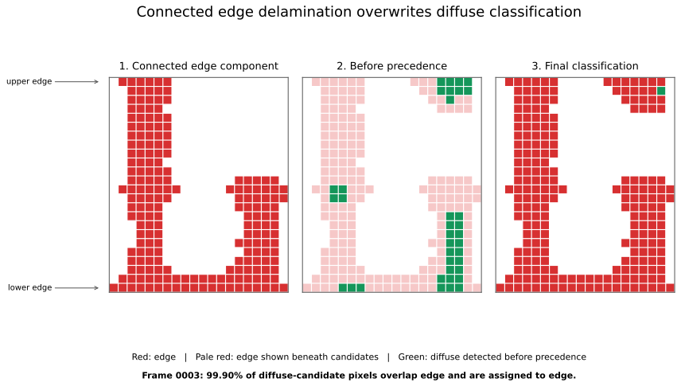

01 - Getting Started
====================

Goal
----

Run one complete DelaDect analysis: load a cross-ply specimen, detect the two
crack families, use those cracks to guide diffuse delamination detection, detect
edge delamination, and save overlays, masks, metrics, and a specimen manifest.

This example makes sense as the first example because crack detection is not an
isolated end product here. It supplies the regions of interest required by the
diffuse-delamination stage.

Run it
------

From the repository root, after installing DelaDect:

.. code-block:: bash

   python examples/01_getting_started.py

The complete runnable source is ``examples/01_getting_started.py``. It uses the
five frames in ``example_images/sample-1`` and writes only below
``results/01-getting-started``.

Workflow
--------

The specimen is created with :meth:`deladect.specimen.Specimen.from_cross_ply`,
which adds 0-degree and 90-degree plies and their shared interface. The example
then runs:

.. code-block:: python

   crack_results = crack_eval_crossply(
       specimen,
       export_images=True,
       background=True,
       save_cracks=True,
   )
   cracks = Specimen.join_cracks(
       crack_results["0"]["cracks"],
       crack_results["90"]["cracks"],
   )

   detector = DelaminationDetector(specimen, specimen.interfaces[0])
   result = detector.detect_both_delaminations(
       cracks=cracks,
       avg_crack_width_px=8.0,
       save_overlays=True,
       overlay_view="classified",
       save_masks=True,
       save_metrics=True,
   )

Static-reference preprocessing is selected automatically for this combined,
single-interface workflow. Rolling-median preprocessing is reserved for the
multi-interface edge example.

Results to inspect
------------------

- ``results/01-getting-started/cracks/`` contains crack overlays and bundles.
- ``results/01-getting-started/delamination/both/overlays/`` contains the
  classified edge/diffuse overlays.
- ``results/01-getting-started/delamination/both/metrics/frame_metrics.csv``
  contains edge, diffuse, overlap, and combined fractions.
- ``results/01-getting-started/config/specimen.json`` stores the reloadable
  specimen definition and result references.

Known limitation: connected edge regions
----------------------------------------

Frame 0003 illustrates an important classification limitation. Delamination
growing inward from the upper and lower specimen boundaries has connected into
one edge-mask component. That component touches both boundaries and also
occupies part of the specimen middle, where diffuse delamination may physically
be present.

The combined workflow resolves overlap with edge precedence:

.. math::

   M_{\mathrm{diffuse,final}} =
   M_{\mathrm{diffuse,raw}} \cap \neg M_{\mathrm{edge,exclusion}}

Consequently, a diffuse candidate is classified exclusively as edge wherever
the masks overlap. In this frame, 26,032 of 26,058 diffuse-candidate pixels
(99.90 percent) overlap the edge-exclusion mask. Only 26 diffuse pixels survive
in the complete frame. The square-cell diagram below shows the mask relationship
over the full specimen height in a representative 600-pixel-wide region.

   Sample-1 frame 0003, shown as 30-by-30-pixel square cells over the full
   specimen height. Panel 1 isolates the edge component that touches both the
   upper and lower boundaries. Panel 2 shows diffuse candidates as green
   vertical stripes over the pale-red edge mask. In panel 3, those stripes are
   red because edge precedence overwrites the overlapping diffuse label.

This demonstrates ambiguity in the classification rule, not proof of the
physical damage class at every pixel. Once edge regions connect through the
middle, DelaDect cannot represent coexisting edge and diffuse labels there.

Regenerate the figure after running this example with:

.. code-block:: bash

   python examples/make_connected_edge_limitation_figure.py

Continue with :doc:`advanced_options` to control the image regions explicitly.
