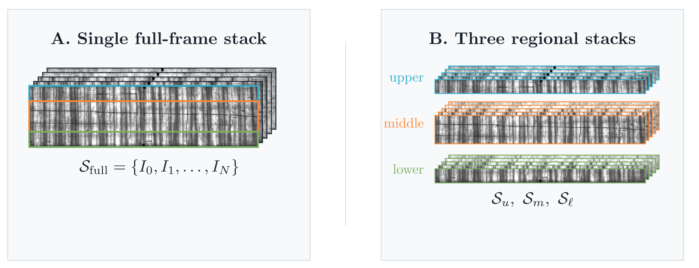
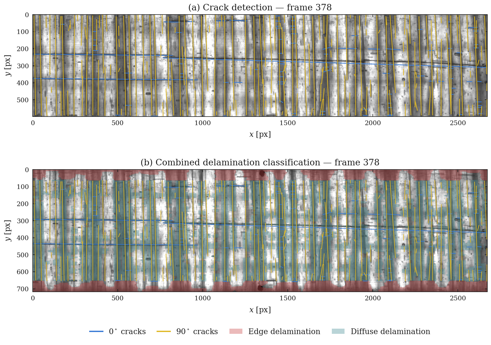
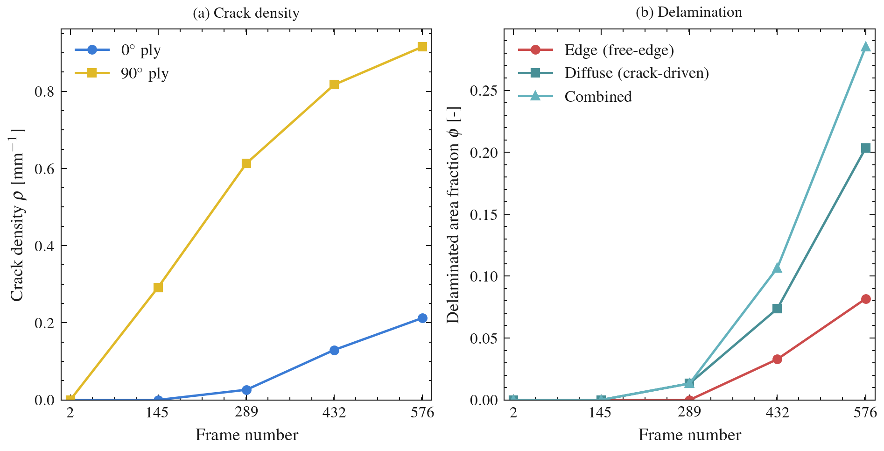
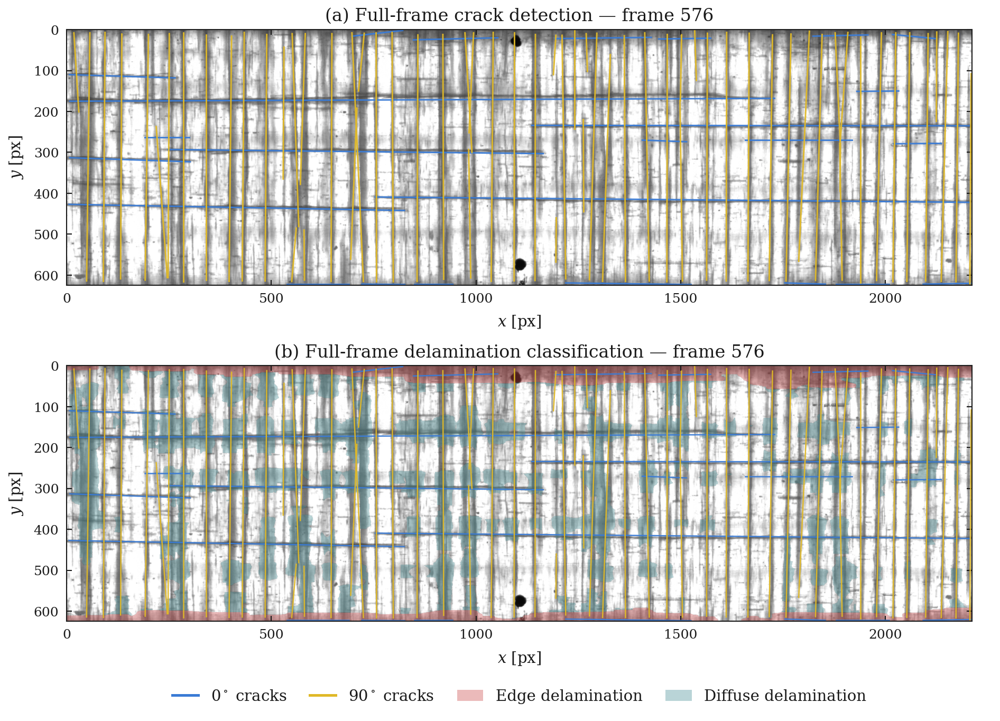
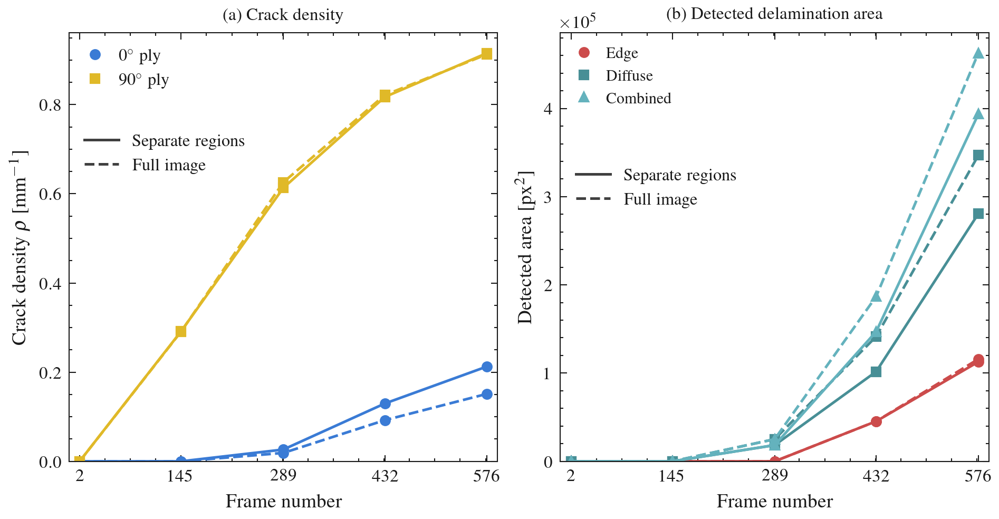

01 - Getting Started
====================

This first example aims to show a complete DelaDect workflow, including
crack detection, diffuse delamination detection, and edge delamination detection. 

A `Binder <https://mybinder.org/v2/gh/vascodcpires/deladect/main?labpath=notebooks/getting_started.ipynb>`_,
notebook which serves as a companion to this example is available in the repository and can be run 
without installation.

The first step of any analysis in DelaDect is to create a specimen object. The specimen 
object serves as a container for all the relevant information about the analysis.
The specimen is built by constructing a 
:class:`~deladect.specimen.Specimen` object and calling
:meth:`~deladect.specimen.Specimen.add_ply` to add plies and calling 
:meth:`~deladect.specimen.Specimen.add_interface` for the interfaces. 
Here plies are associated with the crack detection and in which orientation
the cracks are aligned and interfaces are associated with the delamination detection.
For a diffuse-edge delamination detection, defining an interface is not mandatory, however
it is mandatory for multi-interface delamination detection (see :doc:`delamination_multi_interface`).

There are two ways of supplying the specimen images to DelaDect: either by providing a single full-frame 
stack or by providing three separate stacks for the upper, middle, and lower regions of the specimen (here,
assuming that the specimen is oriented horizontally).

The benefit of providing separate stacks is that the edge detection 
can be constrained to the upper and lower regions and diffuse delamination (and crack detection) 
can be constrained to the middle region. This can be useful when edge and diffuse delamination
end up connected in a given specimen and edge delamination takes over (see how edge delamination is
computed in :doc:`../edge_delamination`).

In the following snippet, a specimen object is created with three separate stacks and the plies and inerface
are added. As a reminder, an assumption of the tool are that cracks are oriented in the same direction as the 
plies. More details about the crack detection can be found in :doc:`../detection`.

.. code-block:: python

   # imports
   from deladect.detection import DelaminationDetector, crack_analysis
   from deladect.io import save_specimen
   from deladect.specimen import Specimen

   # specimen object
   specimen = Specimen(
       name="01-getting-started",
       scale_px_mm=31.953,
       path_full="example_images/sample-1/full",
       path_upper_border="example_images/sample-1/upper",
       path_middle="example_images/sample-1/middle",
       path_lower_border="example_images/sample-1/lower",
       image_types=["png"],
       avg_crack_width_px=8.0,
   )
   
   # add plies to the specimen and defines orientation of the cracks
   ply0 = specimen.add_ply(name="ply_0", orientation_deg=0.0, avg_crack_width_px=8.0, min_crack_length_px=90.0)
   ply90 = specimen.add_ply(name="ply_90", orientation_deg=90.0, avg_crack_width_px=8.0, min_crack_length_px=90.0)

   interface = specimen.add_interface(name="i0", upper_ply=ply0, lower_ply=ply90)

After the specimen is created, the crack detection can be run with :func:`crack_analysis`. This step is only required
if diffuse delamination is required for the analysis.

.. code-block:: python

   crack_results = crack_analysis(
       specimen,
       export_images=True,
       background=True,
       save_cracks=True,
   )

For the crack analysis, the main parameters used are ``avg_crack_width_px`` and ``min_crack_length_px``,
and those are defined in the ply object and are inherited from
`CrackDect <https://crackdect.readthedocs.io/en/latest/index.html>`_ [Drvoderic2022]_.
This example uses ``avg_crack_width_px=8.0`` consistently for the specimen and both plies.

The output of the function is a structured dictionary with the crack detection results for each orientation. 
The output can be used directly for diffuse delamination, as shown in the following code snippet.

.. code-block:: python

   detector = DelaminationDetector(
       specimen,
       interface,
       save_preprocess_outputs=True,
   )

   # diffuse delamination parameters
   diffuse_params={
       "window_diffuse": (30, 30),
       "diffuse_dx": 40.0,
       "diffuse_dy": 10.0,
   }

  
   # edge delamination parameters
   edge_params={
       "window_edge": (1, 90),
       "seed_ratio": 0.01,
   }

   # performs both edge and diffuse delamination
   result = detector.detect_both_delaminations(
       cracks=crack_results,
       save_overlays=True,
       save_metrics=True,
       diffuse_params=diffuse_params,
       edge_params=edge_params
   )

The suggested parameters for the delamination detection for this example are the ones presented in the code snippet above:

- ``window_edge`` and ``window_diffuse`` are the sizes of the sliding windows used for the edge and diffuse
  detection, respectively. For a window of size ``(wy, wx)``, the image is passed through a maximum filter
  followed by a minimum filter, both using that window size. In practise, the
  window size controls how cracks and noise are filtered out from the delamination detection. A higher window size
  will filter out more cracks (or any straight thin features) and noise, but there will also risk filtering out delamination.
- ``diffuse_dx`` and ``diffuse_dy`` are the dimensions of the region of interest (ROI) around each crack used to
  compute the diffuse delamination.
- ``seed_ratio`` is the fraction of rows, starting from the specimen edge, trusted as the initial seed region for
  edge-connected reconstruction. A ratio of 0.01 seeds from the first 1% of rows in each split half.

More information about these and other parameters can be found in
:doc:`Parameter Reference <../parameter_reference>`.
The outputs of the crack and delamination detection with the referred parameters are shown below.

This minimal example shows how to use DelaDect for a complete analysis of a specimen. To go further,
continue with :doc:`delamination_multi_interface` for hierarchical multi-interface edge delamination,
or :doc:`../results_storage` for persisting and reloading a specimen's results.

Using the full frame stack
------------------------------------
As mentioned above, a full image can be provided instead of the three separate
stacks. In this mode the full image is used for crack and diffuse delamination
detection. For edge delamination, the tool divides each full frame into upper
and lower halves and processes both free edges with the same edge-seeding.

With this example, it is a good time to introduce the built-in factory methods for specimen creation.
DelaDect provides two pre-defined layup constructors on :class:`~deladect.specimen.Specimen`:

- :meth:`~deladect.specimen.Specimen.from_cross_ply`, used below, builds a ``[0, 90]`` cross-ply
  laminate: it automatically creates two plies, at 0° and 90°, and one interface between them.
- :meth:`~deladect.specimen.Specimen.from_plus_minus` builds a ``[+θ, -θ]`` laminate instead: it
  creates two plies at ``angle_deg`` and ``-angle_deg`` (plus an optional third ply at 90° when
  ``transverse_layer=True``), and adds the interface(s) between them automatically.

.. code-block:: python

   specimen_full = Specimen.from_cross_ply(
       name="01-getting-started-full",
       scale_px_mm=31.953,
       path_full="example_images/sample-1/full",
       image_types=["png"],
       avg_crack_width_px=8.0,
       min_crack_length_px=90.0,
   )

The detected cracks and classified delamination for the full-image workflow are
shown below.

The following plots compare the region-based and full-image workflows directly.
Solid lines represent the separate-region analysis and dashed lines represent
the full-image analysis. Delamination is reported as detected pixel area, in
px\ :sup:`2`, rather than area fraction, so the underlying mask sizes can be
compared directly.

The plots show that, because the diffuse-detection domain is larger for the full image, more diffuse delamination is
detected. By splitting the image into regions, diffuse detection is restricted to the middle region, so any diffuse damage
close to the specimen edge is simply outside that domain and cannot be detected. For this specific sample, using the
full image is therefore the better choice. In other cases, however, where edge and diffuse delamination
grow into contact with each other, splitting the image into regions can be preferable, since edge delamination must be
connected to the specimen edge, and takes precedence over diffuse delamination wherever the two overlap, so an
unconstrained full-image analysis can misclassify diffuse damage as edge damage once they connect. For a deeper
understanding of this mechanism, see :doc:`../edge_delamination`, which includes further examples and explanations.

References
----------

.. [Drvoderic2022] Drvoderic, M., Bender, J. J., Pletz, M., & Schuecker, C. (2022).
   Version 0.2 - CrackDect: Detecting crack densities in images of fiber-reinforced
   polymers. *SoftwareX*, 19, 101198.
   `<https://doi.org/10.1016/j.softx.2022.101198>`_
