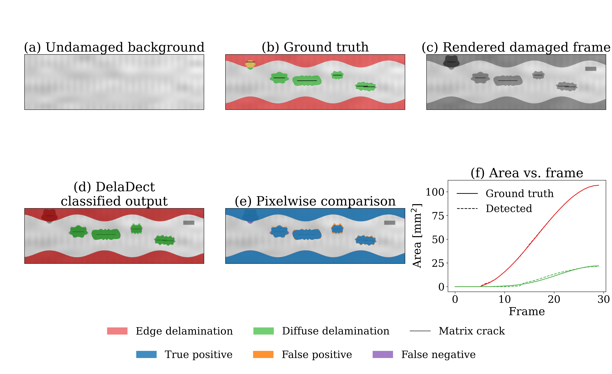
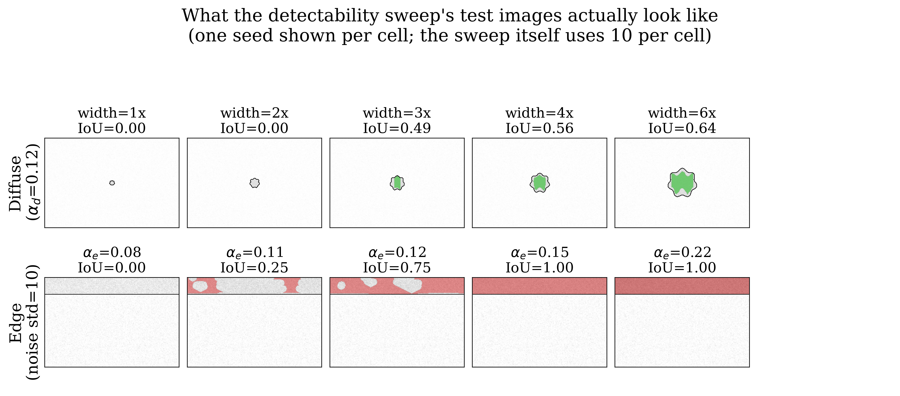
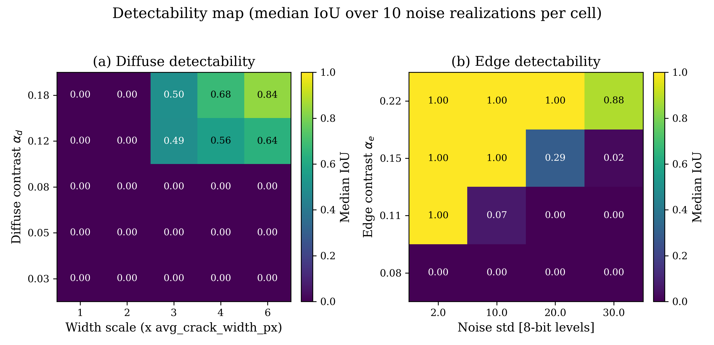
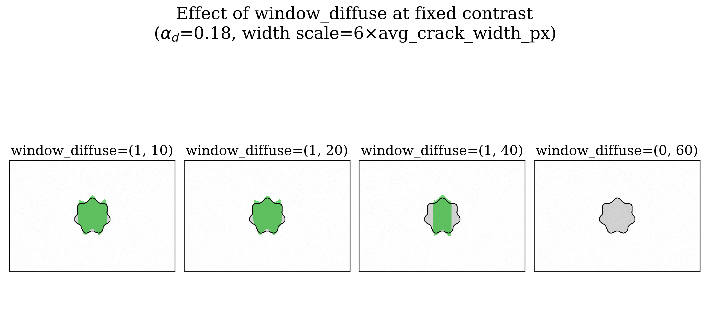

03 - Synthetic Delamination Validation
=======================================

Purpose
-------

The previous examples run DelaDect on real specimen images, where the true
extent of delamination is only approximately known. This example instead
generates an artificial image sequence with *exactly known* geometry --
prescribed edge fronts, diffuse blobs, matrix cracks, and one region
deliberately designed to be rejected -- and runs the normal public DelaDect
workflow on it, so the detected masks can be compared pixel-by-pixel against
ground truth.

.. note::

   This is a controlled software-verification example, not a claim of full
   experimental validation. It demonstrates that the implementation
   reproduces known, prescribed geometry correctly, that the edge/diffuse
   precedence rule behaves as documented, and that edge-connected
   reconstruction rejects a disconnected dark region as intended -- see
   :doc:`../methodology` for the algorithmic description this example
   checks.

.. warning::

   This page does **not** prove performance on real experimental TWLI data
   of arbitrary quality, and it does **not** replace validation against
   manually annotated experimental images. Treat every number below as "what
   this implementation does on known, synthetic geometry," not as an
   accuracy claim about real specimens.

The script is deterministic for a fixed random seed and regenerates
everything (images, ground truth, detection run, metrics, figure) from a
clean checkout. A second, companion script produces the robustness/
detectability material further down this page:

.. tab-set::

   .. tab-item:: Main demonstration

      Six-panel figure, metrics CSV, boundary/front-error columns --
      everything in the :ref:`synthetic-validation-result` section below.

      .. code-block:: bash

         python examples/synthetic_delamination_validation.py

   .. tab-item:: Robustness study

      Detectability heatmaps, the ``window_diffuse`` worked example, and the
      package-default comparison -- everything from
      :ref:`synthetic-validation-operating-range` onward.

      .. code-block:: bash

         python examples/synthetic_delamination_robustness.py

Both write generated frames, mask bundles, and metrics under
``results/synthetic_validation/`` (not committed -- regenerate as needed),
and copy their metrics CSVs and figures into
``docs/source/_static/delamination/``.

.. grid:: 2 2 4 4
   :gutter: 2

   .. grid-item-card:: Main result
      :link: synthetic-validation-result
      :link-type: ref

      Six-panel figure: ground truth vs. DelaDect output, IoU/Dice/area
      error.

   .. grid-item-card:: Operating range
      :link: synthetic-validation-operating-range
      :link-type: ref

      Detectability heatmaps: where does detection actually fail?

   .. grid-item-card:: Choosing window_diffuse
      :link: synthetic-validation-window-diffuse
      :link-type: ref

      A worked, visual example of the parameter-scale trade-off.

   .. grid-item-card:: Boundary metrics
      :link: synthetic-validation-boundary-metrics
      :link-type: ref

      Why area IoU alone can hide a boundary/front-position problem.

How the artificial sequence is generated
-----------------------------------------

Each of the 30 frames is rendered from an undamaged background
:math:`B(x, y)` (a smooth illumination gradient, low-frequency specimen
texture, and weak periodic fibre/stitching lines) using

.. math::

   I_n(x, y) = g_n\, B(x, y)\,
   \bigl[1 - \alpha_e E_n - \alpha_d D_n - \alpha_c C_n - \alpha_x X_n\bigr]
   + \eta_n(x, y),

where :math:`E_n`, :math:`D_n`, and :math:`C_n` are the edge-delamination,
diffuse-delamination, and matrix-crack masks; :math:`X_n` is the disconnected
distractor region (not a ground-truth delamination type); :math:`g_n` is a
small (2%) global brightness drift; and :math:`\eta_n` is Gaussian noise. The
result is mildly blurred and clipped to 8-bit range. Frame 0 has
:math:`E_0 = D_0 = C_0 = X_0 = 0` and is used directly as the undamaged
reference.

Cracks, edge delamination, and diffuse delamination
------------------------------------------------------

**Cracks.** Six horizontal matrix cracks are defined by their exact
``(y, x)`` endpoints and appear (all at once, non-growing) from frame 2
onward. They are passed directly to diffuse detection as ground truth --
this example does not run crack detection, so delamination results are not
conflated with crack-detection error.

**Edge delamination** grows from both specimen borders following a
non-uniform front

.. math::

   h_n(x) = h_0(n) + a \sin\!\left(\frac{2\pi x}{\lambda}\right),

with :math:`h_0(n)` a smooth, monotonically increasing ramp starting at
frame 4. One disconnected dark rectangle (the *distractor*) sits near, but
never touching, the top edge front -- there is always at least one
undamaged row separating it from the true edge region. It is intentionally
excluded from the edge ground truth to demonstrate that edge-connected
reconstruction rejects candidates that never actually touch the border,
regardless of contrast.

**Diffuse delamination** grows around all six cracks, in four different
morphologies, each with a small deterministic angular boundary perturbation
so the masks are not perfectly geometric:

- a localized ellipse around one crack,
- a narrow band extending along a second crack,
- an irregular two-lobed region around a third crack,
- two ellipses around a fourth and fifth crack that partially overlap once
  grown.

The sixth crack's diffuse region (also an ellipse) is placed so that, in
later frames, it grows into the region also claimed by the growing edge
front -- verified directly against the detector's own output (see
``tests/test_synthetic_delamination.py``), not just asserted from the
ground-truth construction. The ground-truth combination follows the same
precedence rule as
:meth:`~deladect.detection.delamination.core.DelaminationDetector.detect_both_delaminations`:

.. math::

   D_n^{\mathrm{final}} = D_n^{\mathrm{raw}} \setminus E_n,
   \qquad
   M_n = E_n \cup D_n^{\mathrm{final}}.

All masks grow monotonically over the sequence, and cumulative ground truth
:math:`G_n^{\mathrm{cum}} = \bigcup_{j \le n} G_j` is compared against
DelaDect's own cumulative (latched) output, since detection latches damage
over time.

Minimal runnable example
--------------------------

.. code-block:: python

   from examples.synthetic_delamination_validation import (
       generate_synthetic_sequence,
       run_detection,
       compute_metrics,
   )

   sequence = generate_synthetic_sequence()          # seed=20260825, 30 frames
   run = run_detection(sequence)                      # writes PNGs, runs detect_both_delaminations
   masks = run["result"]["masks"]

   metrics = compute_metrics(
       frame_indices=list(range(len(sequence["frames"]))),
       det_masks=masks,
       gt_cum={
           "edge_gt_cum": sequence["edge_gt_cum"],
           "diffuse_final_gt_cum": sequence["diffuse_final_gt_cum"],
           "combined_gt_cum": sequence["combined_gt_cum"],
       },
       scale_px_mm=sequence["params"]["scale_px_mm"],
   )

Detection uses one fixed parameter set for the whole sequence (no per-frame
tuning, and the ground-truth masks are never used during detection). Two
choices are specific to this synthetic image scale rather than the package
defaults, and are worth calling out explicitly:

- ``edge_exclusion_px=0``. By default, ``detect_both_delaminations`` dilates
  the edge mask by a few pixels *before* resolving edge/diffuse overlap, so
  that a thin halo around real edge damage is conservatively claimed as
  edge. Setting it to zero makes the detector's precedence rule match the
  ground-truth formula above exactly, pixel for pixel, which is what this
  example is checking.
- ``window_diffuse=(1, 20)`` (vs. the package default ``(0, 60)``). Diffuse
  pre-thresholding applies a grayscale morphological closing over this
  window; a window wider than a blob's own extent perpendicular to its
  crack erases the blob entirely. The default (0, 60) is tuned for real
  specimen images where diffuse damage is typically wider than 60 px; this
  synthetic sequence uses smaller blobs; see :doc:`../parameter_reference`
  for what every parameter does.

.. _synthetic-validation-result:

Result
------

   **(a)** Undamaged background, frame 0. **(b)** Prescribed ground-truth
   cracks (black) and damage masks at frame 29, in the same colour
   convention as :doc:`../edge_delamination` and :doc:`../diffuse_delamination`
   (red = edge, green = diffuse). **(c)** The corresponding rendered
   artificial frame. **(d)** DelaDect's classified output on that frame,
   same colour convention. **(e)** Pixelwise comparison between DelaDect's
   cumulative combined mask and the cumulative combined ground truth --
   *this uses a different colour scheme from (b)/(d)*: green = true
   positive, red = false positive, blue = false negative. **(f)** Detected
   vs. ground-truth area (mm\ :sup:`2`) per frame; solid = ground truth,
   dashed = detected, for both edge and diffuse delamination.

Metrics (IoU, Dice, and signed/absolute/relative area error for edge, final
diffuse, and combined delamination, at every frame) are written to
``results/synthetic_validation/metrics/synthetic_validation_metrics.csv``,
with a copy at
``docs/source/_static/delamination/synthetic_validation_metrics.csv``. From
the run that produced the figure above (frame 29, the fully-grown state):

.. list-table::
   :header-rows: 1

   * - Channel
     - IoU
     - Dice
     - Relative area error
   * - Edge
     - 0.993
     - 0.997
     - 0.0004
   * - Diffuse (final)
     - 0.806
     - 0.893
     - -0.021
   * - Combined
     - 0.972
     - 0.986
     - 0.010

Averaged over every frame where the combined ground truth is non-empty:
mean IoU 0.935, mean Dice 0.965. These are the actual numbers this specific
seed/parameter combination produces, not targets -- rerunning with a
different seed or parameter set will shift them.

.. note::

   A single seed at one fixed, generous contrast (:math:`\alpha_e = \alpha_d
   = 0.35`) is a correctness check, not evidence about *where* detection
   starts to struggle. The three sections below (operating range, parameter
   scale, and boundary error) exist specifically to show that harder regime
   and to say plainly where this main demonstration sits relative to it,
   rather than leaving one favourable-looking run to speak for the whole
   method -- see the "Robustness study" tab near the top of this page to
   regenerate them.

.. _synthetic-validation-operating-range:

Operating range: a detectability map
--------------------------------------

The result above uses one seed and one contrast level per damage type. That
is enough to check correctness, but not to show *where* detection starts to
fail. This section instead sweeps damage contrast and size/noise over
multiple independent noise realizations and reports the median final-state
IoU as a heatmap -- the closest DelaDect equivalent to a MatrixCraCS-style
artificial-data detectability figure, and in the spirit of the domain-
randomization idea of characterizing behaviour across many synthetic
appearances rather than one (Tobin et al., 2017).

For diffuse delamination, the swept grid is damage contrast :math:`\alpha_d
\in \{0.03, 0.05, 0.08, 0.12, 0.18\}` against diffuse-region width relative
to ``avg_crack_width_px`` (width scale :math:`\in \{1, 2, 3, 4, 6\}`), with
10 independent noise realizations per cell. For edge delamination, it is
edge contrast :math:`\alpha_e \in \{0.08, 0.11, 0.15, 0.22\}` against
Gaussian noise standard deviation (in 8-bit levels, :math:`\in \{2, 10, 20,
30\}`), also 10 realizations per cell. Both use this example's detection
parameters (``window_diffuse=(1, 20)`` / ``window_edge=(1, 20)``), held
fixed across the whole grid -- only the synthetic geometry and noise change
between cells, never the detection parameters.

.. note::

   To make a ~250-cell sweep tractable, these two grids skip raw-image
   rendering and preprocessing and instead synthesize the
   *ratio-normalized processed frame* directly (uniform undamaged
   background, damage darkened by the swept contrast, Gaussian noise added
   in ratio space) -- see the module docstring in
   ``examples/synthetic_delamination_robustness.py`` for exactly what this
   does and does not claim to reproduce from the full pipeline. This is a
   deliberately minimal test scene, **not** a smaller version of the
   six-panel demo above: 160x240 px, one crack, one blob, no distractor, no
   growth over time (just an undamaged frame and one damaged frame), and no
   background texture/gradient/stitching.

The figure below shows exactly what these test images look like, for one
seed per cell (the sweep itself uses 10):

   Top row: diffuse blob at fixed contrast (:math:`\alpha_d=0.12`), width
   scale 1x-6x. Bottom row: edge band at fixed noise (std=10), contrast
   0.08-0.22. Green/red = DelaDect's detected mask; black outline = ground
   truth. These are single-cell, single-seed illustrations of the same
   sweep whose *aggregate* median-over-10-seeds result is the heatmap below
   -- individual images like these are what feed each heatmap cell, not
   the heatmap's own visual.

   **(a)** Diffuse detectability: median IoU vs. contrast and width scale.
   **(b)** Edge detectability: median IoU vs. contrast and noise level.

Two distinct regimes are visible in panel (a), not one smooth gradient:
width scale 1-2 (blob diameter 8-16 px) is at 0.00 IoU for *every* contrast
tested, including :math:`\alpha_d = 0.18` -- confirmed separately (not shown
on the grid) to stay at 0.00 even at :math:`\alpha_d = 0.5`. This is a hard
geometric cutoff, not a soft contrast effect: ``window_diffuse=(1, 20)``'s
morphological closing erases anything narrower than roughly its own window,
regardless of how dark it is. Only once width scale reaches 3 (diameter
:math:`\approx` 24 px, comparable to the window) does contrast start to
matter at all, and from there median IoU increases with both axes, up to
0.84 at the top-right corner. Panel (b) shows the opposite character: a
fairly sharp contrast threshold near :math:`\alpha_e \approx 0.10`-0.11 --
consistent with the edge detector's ``hard_floor=0.90`` gate, which requires
roughly :math:`\alpha_e \gtrsim 0.10` to cross at all -- above which
detection is essentially perfect (IoU 1.00) up to moderate noise, degrading
only once noise grows large relative to the margin above that threshold
(:math:`\alpha_e = 0.15` drops from 1.00 to 0.02 between noise std 10 and
30; :math:`\alpha_e = 0.22` stays at 0.88+ through noise std 30).

Put together: this main example's own contrast (0.35 for both damage types)
sits above the top of both swept ranges by design, in the unambiguously
detectable corner of both maps -- deliberately, since its job is to check
correctness (precedence, cumulative growth, distractor rejection) without
also fighting marginal detectability. The maps above are what characterizes
the harder, more realistic regime.

.. _synthetic-validation-window-diffuse:

Choosing window_diffuse: a worked example
---------------------------------------------

The main result above uses ``window_diffuse=(1, 20)`` instead of the
package default ``(0, 60)``, justified earlier as "the artificial blobs are
smaller than the package default expects."

.. note::

   Taken alone, that explanation is easy to misread as tuning the method
   until it happened to work. This section shows the same blob through four
   window settings, so the effect is visible rather than asserted.

   Same blob (:math:`\alpha_d = 0.18`, width scale 6, one fixed noise
   realization), same detector, same everything except ``window_diffuse``.
   Green = detected, black outline = ground truth.

At this blob size, a narrower window (1, 10) and this example's setting
(1, 20) perform almost identically (IoU 0.85 and 0.84) -- both comfortably
resolve the blob, with a small amount of recall lost right at the wavy
boundary's sharpest concave notches. Widening to (1, 40) visibly erodes the
detected region into a narrower band (IoU drops to 0.62) -- the
morphological closing already described in :doc:`../parameter_reference`
starts merging the blob's interior into its (still bright) surroundings.
The package default (0, 60) erases it completely (IoU 0.00): the window is
now wider than the blob itself. This is exactly the failure mode the
detectability map's sharp width cutoff was showing in aggregate, made
visible on one concrete case.

That default of 60 px is not an arbitrary "too big" number chosen for this
demonstration, either -- it reflects real specimen diffuse damage typically
being wider than that. To show the effect on this example's *own* geometry
rather than only the small illustrative blob above, the same comparison was
also run on the six-crack main sequence itself (all real rendered noise,
real static-reference preprocessing, only ``window_diffuse`` changed),
comparing final-frame diffuse IoU against the ground truth used throughout
this page:

.. list-table::
   :header-rows: 1

   * - ``window_diffuse``
     - Diffuse IoU (main sequence, final frame)
   * - Package default ``(0, 60)``
     - 0.576
   * - Scale-matched ``(1, 20)`` (used throughout this page)
     - 0.784

The package default does not fail outright here -- unlike the small
illustrative blob above, several of the main sequence's diffuse regions
grow past 60 px by the final frame -- but it is markedly worse throughout
the sequence (0.576 vs. 0.784), which is the honest, non-cherry-picked
version of "parameter scale matters": not a binary works/erased split, but
a real, measurable, and explicable cost to leaving a window mismatched to
feature size.

.. _synthetic-validation-boundary-metrics:

Boundary-sensitive metrics
------------------------------

Area IoU is dominated by interior pixels. The edge region above is large,
so an edge IoU of 0.993 could in principle conceal a real front-position
error and still look excellent by area alone. Two additional metrics target
this directly, computed for every frame and included as extra columns in
the metrics CSV:

- **Boundary IoU** (Cheng et al., 2021): IoU restricted to a
  ``dilation_px``-wide band just inside each mask's boundary
  (``boundary_iou()`` in ``examples/synthetic_delamination_validation.py``,
  default ``dilation_px=5``), rather than the whole interior.
- **Edge front error**: for every column :math:`x`, compare the detected
  and ground-truth front position (number of contiguous damaged pixels from
  the border),

  .. math::

     e_{\mathrm{front}} = \sqrt{\frac{1}{N_x}\sum_x \bigl[y_{\mathrm{det}}(x) - y_{\mathrm{GT}}(x)\bigr]^2},

  pooling both the top and bottom fronts, reported as MAE and RMSE in
  pixels and mm.

At the final frame of the main result above:

.. list-table::
   :header-rows: 1

   * - Channel
     - Area IoU
     - Boundary IoU
   * - Edge
     - 0.993
     - 0.915
   * - Diffuse (final)
     - 0.806
     - 0.285
   * - Combined
     - 0.972
     - 0.744

Edge front error: MAE 0.48 px (0.012 mm), RMSE 0.93 px (0.023 mm).

.. dropdown:: Why does edge boundary IoU drop so much when the front error is under a pixel?
   :icon: question
   :color: info

   The gap between area and boundary IoU is real and informative, but it
   does not mean what a naive reading might suggest. Edge boundary IoU
   (0.915) is noticeably below its area IoU (0.993) -- yet the
   front-position error itself is under one pixel (RMSE 0.93 px, an order
   of magnitude below the ``post_threshold_closing_px=10`` closing radius
   used in detection). So the boundary-IoU drop here is **not** evidence of
   a systematic front-position offset; it reflects that a boundary-IoU band
   is inherently thin and sensitive to a few pixels of local jaggedness
   along an otherwise well-located front, which area IoU simply cannot see
   either way. Diffuse boundary IoU (0.285) is a much larger drop from its
   already-lower area IoU (0.806) -- consistent with its ground-truth
   boundary carrying a deliberate wavy perturbation (see above) that a
   smoothing-then-thresholding pipeline does not reproduce pixel-for-pixel,
   even where it correctly identifies the region overall. In short:
   boundary IoU is doing real work here -- it is not redundant with area
   IoU -- but reading it in isolation, without the front-error numbers
   alongside it, would have overstated the edge front's positional error
   specifically.

Interpretation
---------------

Edge delamination is recovered almost exactly (IoU > 0.99 by the final
frame): its ground truth is a large, high-contrast, border-connected region,
which is exactly what the edge algorithm is built to find, and the
disconnected distractor is correctly excluded throughout. Diffuse
delamination is recovered well once blobs exceed roughly the
``window_diffuse`` closing scale, with lower IoU than edge -- expected,
since diffuse blobs are smaller, lower-contrast, and their true boundary
includes the deterministic wavy perturbation, which a smoothing-then-
thresholding pipeline will not reproduce pixel-perfectly even when it
correctly identifies the region. The frame where crack "E"'s diffuse blob
grows into the edge front is where the combined ground truth and combined
detected masks agree on classifying the overlap as edge, confirming the
precedence rule holds end to end, not just in the ground-truth construction.

Limitations
------------

This is synthetic verification under known, favourable conditions (known
crack locations, a simple additive/multiplicative damage model, no
artefacts like specular glare, sensor banding, or out-of-plane specimen
motion) -- see the warning near the top of this page for what that does and
does not establish. In addition:

- Diffuse detection here is given the exact ground-truth crack segments; it
  does not exercise crack detection or crack tracking
  (``track_cracks=True``), which have their own error sources not
  represented in these metrics.
- The chosen contrast levels (:math:`\alpha_e, \alpha_d \approx 0.35`) are
  comfortably above the detector's ``hard_floor`` gate; real delamination
  contrast varies substantially with specimen, layup, and imaging setup, and
  can be much closer to the detection threshold.

.. warning::

   ``window_diffuse=(1, 20)`` was reduced specifically for this synthetic
   image's smaller blob scale. This is **not** a general recommendation for
   real data -- the package default ``(0, 60)`` is tuned to typical
   real-specimen diffuse damage sizes, and copying ``(1, 20)`` onto real
   data with larger diffuse regions would likely make results worse, not
   better (see the sharp width-driven cutoff in the detectability map
   above).

- The detectability-map sweeps synthesize the ratio-normalized processed
  frame directly rather than rendering and preprocessing raw 8-bit images
  (unlike the main sequence above); this isolates the detection-threshold
  behaviour but does not exercise preprocessing itself, and only varies one
  or two factors at a time (contrast/width, or contrast/noise) rather than
  the full combination of illumination, texture, and distractors varied in
  the main sequence.
- 10 noise realizations per grid cell is not a claim of statistical power;
  it gives a median that is qualitatively informative (the sharp thresholds
  visible in the heatmap are repeatable), not a confidence interval.

References
-----------

- J. Tobin et al., "Domain Randomization for Transferring Deep Neural
  Networks from Simulation to the Real World," 2017.
- B. Cheng et al., "Boundary IoU: Improving Object-Centric Image
  Segmentation Evaluation," CVPR 2021.
