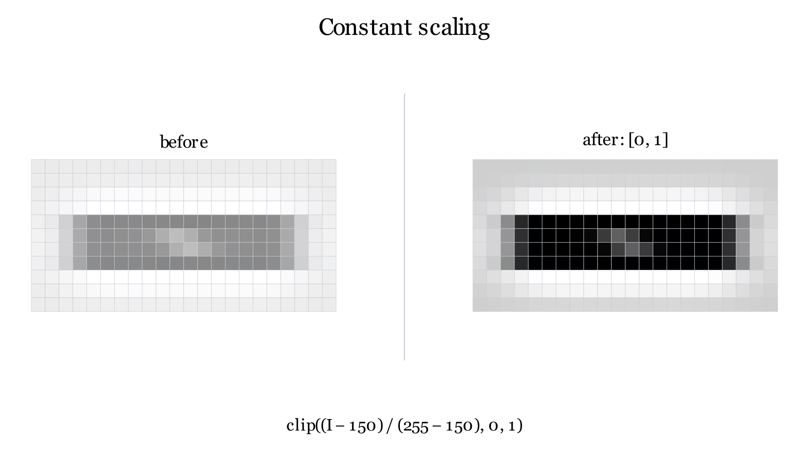

Image Operations
================

The animations below use one synthetic image with oversized pixels.  The same
delamination band is carried through every operation so that each change can
be followed directly.

Directional max/min filtering
-----------------------------

The horizontal ``1 × 5`` window removes narrow vertical crack artefacts while
retaining the longer horizontal delamination band.  The maximum pass is
followed by the minimum pass.

Sharpening and Gaussian smoothing
---------------------------------

The cleaned max/min output is sharpened and then smoothed directionally.  The
horizontal Gaussian width is larger than the vertical width, following the
orientation of the free edge.

Constant scaling
----------------

The smoothed intensities are mapped to ``[0, 1]`` using fixed lower and upper
bounds.  Values outside the bounds are clipped.

Thresholding
------------

Pixels below the threshold become the binary delamination candidate mask.

Morphological closing
---------------------

Closing is a dilation followed by an erosion.  Dilation first expands the
candidate mask so that nearby regions meet and small spaces disappear.  The
erosion then removes a layer from the outside, returning the band roughly to
its original thickness.  The newly bridged spaces remain filled because they
are now inside the connected region.  The animation displays the ``3 × 3``
discrete disk with radius one pixel; production uses the configured closing
radius in the same way.

Frame-to-frame latching
-----------------------

The current detection is combined with the previous latched mask using a
cumulative OR.  Blue pixels were already detected, yellow pixels occur in
both masks, and red pixels are newly added.  Consequently, previously
detected delamination is retained even if it is absent from a later frame.

