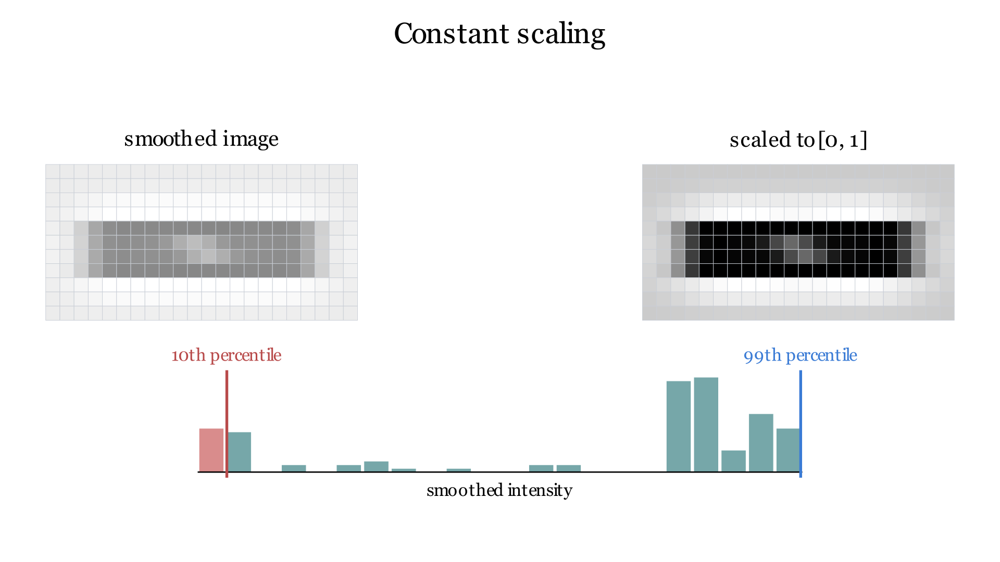

Image Operations
================

This page serves as an explanation for the image operations used
in the delamination detection.

Directional max/min filtering
-----------------------------

The horizontal ``1 × 5`` window removes narrow vertical crack artefacts while
retaining the longer delamination band.  The maximum pass is
followed by a minimum pass. As it can be see in the animation below,
when the max filter is performed, darker crack pixels are replaced by the surrounding
brighter background, so isolated cracks are removed while most of the
delamination remains. However, the maximum filter can also remove delamination 
close to its left and
right boundaries. To recover these regions, a minimum filter with the same
window size is applied afterwards.

Sharpening and Gaussian smoothing
---------------------------------

The cleaned max/min output is sharpened and then smoothed directionally.  The
horizontal Gaussian width is larger than the vertical width, following the
orientation of the free edge.

Constant scaling
----------------

The smoothed intensity histogram is used to choose a lower and an upper
scaling point. By default these are the 10th and 99th percentiles. Pixels at
or below the lower percentile are mapped to 0, pixels at or above the upper
percentile are mapped to 1, and values between them are mapped linearly.

The percentile levels can be changed when a different part of the intensity
distribution should define the useful range. Because the scaling points are
computed from the image distribution, they adapt when the image brightness
or contrast changes. The histogram below illustrates the two percentile
locations, the clipped tails, and the linearly mapped interval.

Let :math:`I` denote the smoothed intensity and let :math:`q_{10}` and
:math:`q_{99}` denote the intensity values at the 10th and 99th percentiles,
respectively. The scaled intensity is

.. math::

   I_{\mathrm{scaled}}
   = \operatorname{clip}\!\left(
     \frac{I-q_{10}}{q_{99}-q_{10}},\,0,\,1
     \right).

Thresholding
------------

Pixels below the threshold become the binary delamination candidate mask.

Morphological closing
---------------------

Closing is a dilation followed by an erosion.  Dilation first expands the
candidate mask so that nearby regions meet and small spaces disappear.  The
erosion then removes a layer from the outside, returning the band roughly to
its original thickness.  The newly bridged spaces remain filled because they
are now inside the connected region.  The animation displays the ``3 × 3``
discrete disk with radius one pixel; production uses the configured closing
radius in the same way.

