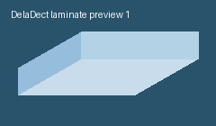

DelaDect: Optical Delamination Detection in Fiber-Reinforced Polymers
=====================================================================

.. image:: deladect_logo.svg
   :alt: DelaDect logo
   :width: 320
   :align: center

DelaDect is a Python package for quantitative damage analysis in optical image
stacks of fiber-reinforced composites. The workflow combines:

- Stage I crack detection (CrackDect-based)
- Stage II edge and diffuse delamination detection
- reusable preprocessing caches and reproducible exports (masks, overlays, CSV)

If you are new here, start with :doc:`examples/getting_started` or :doc:`methodology`.

Quick Start
-----------

It is recommended to use DelaDect in an isolated environment (venv or Conda) so dependencies remain
reproducible and separate from the system's Python.

Installation
~~~~~~~~~~~~
Supported Python is ``>=3.9`` and the recommended version is ``3.10``.
This repository is currently tested with ``Python 3.10``.

Check your current Python version:

.. code-block:: bash

   $ python --version

Create and activate a fresh environment:

.. code-block:: bash

   # Option A: Conda
   $ conda create -n deladect python=3.10 -y
   $ conda activate deladect

   # Option B: venv
   $ python -m venv .venv
   $ .venv\Scripts\activate        # Windows
   # $ source .venv/bin/activate    # Linux/macOS

Then, install DelaDect and dependencies:

.. code-block:: bash

   $ pip install deladect

.. _prerequisites:

Prerequisites
-------------

DelaDect dependencies are installed automatically. 

- `CrackDect <https://pypi.org/project/crackdect/>`_
- `NumPy 1.23.5 <https://numpy.org/>`_
- `SciPy 1.10.0 <https://scipy.org/>`_
- `Pandas 1.3.5 <https://pandas.pydata.org/>`_
- `Matplotlib 3.7.5 <https://matplotlib.org/>`_
- `scikit-image 0.18.1 <https://scikit-image.org/>`_
- `Pillow 8.4.0 <https://python-pillow.org/>`_

Documentation roadmap
---------------------
- Start with :doc:`examples/getting_started` for a first full run.
- Use :doc:`detection` and :doc:`delamination` for algorithm and API details.
- Use :doc:`parameter_truth_table` for default values and where they apply.
- Use :doc:`Image_pre_processing` for normalization strategy tuning.
- Use :doc:`results_storage` when integrating outputs into downstream scripts.

.. toctree::
   :maxdepth: 2
   :caption: User Documentation

   methodology
   Image_pre_processing
   parameter_truth_table
   image_handling
   examples/shift_correction
   detection
   delamination
   results_storage
   utils

Examples
--------

.. toctree::
   :maxdepth: 1
   :caption: Examples

   examples/getting_started
   examples/save_reload_results
   examples/crack_detection
   examples/delamination_multi_interface

API Reference
-------------

.. currentmodule:: deladect

.. autosummary::
   :toctree: generated

   detection
   specimen
   utils

Project Information
-------------------

Authors
~~~~~~~
The current code base was developed by
`Vasco D. C. Pires <www.vascodcpires.com/>`_ with affiliation to the
`Institute Designing Plastics and Composite Materials (TU Leoben) <https://www.kunststofftechnik.at/en/konstruieren>`_.

License
~~~~~~~
This project is licensed under the MIT License.
