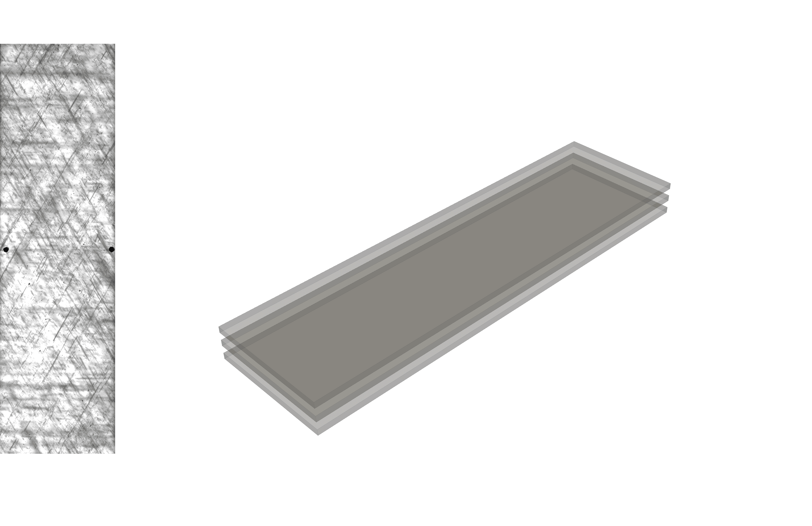

DelaDect: Optical Delamination Detection in Fiber-Reinforced Polymers
=====================================================================

DelaDect is a Python package for quantitative damage analysis in 
fiber-reinforced polymers. Out of the box, the tool is able to perform the detection of cracks
and delamination from a sequence of images. 

The tool is capable of distinguishing between diffuse and edge delamination
and can also distinguish delamination between multiple interfaces under certain conditions (see :doc:`methodology` for details).

If you are new here, start with :doc:`examples/getting_started` after the installation steps below.

Quick Start
-----------

It is recommended to use DelaDect in an isolated environment (venv or Conda) so dependencies remain
reproducible and separate from the system's Python.

Installation
~~~~~~~~~~~~
Supported Python is ``>=3.10``.
You can check your current Python version:

.. code-block:: bash

   $ python --version

Create and activate a new environment (either conda or venv). For example, using conda:

.. code-block:: bash

   $ conda create -n deladect_env python=3.10 -y
   $ conda activate deladect_env

Then, install DelaDect and dependencies:

.. code-block:: bash

   $ pip install deladect

.. _prerequisites:

Prerequisites
-------------

DelaDect dependencies are installed automatically. 

- `CrackDect ≥ 0.2 <https://pypi.org/project/crackdect/>`_
- `NumPy ≥ 1.23.5 <https://numpy.org/>`_
- `SciPy ≥ 1.10.0 <https://scipy.org/>`_
- `Pandas ≥ 1.3.5 <https://pandas.pydata.org/>`_
- `Matplotlib ≥ 3.7.5 <https://matplotlib.org/>`_
- `scikit-image ≥ 0.18.1 <https://scikit-image.org/>`_
- `Pillow ≥ 8.4.0 <https://python-pillow.org/>`_

Documentation overview
----------------------

The documentation is divided into three sections. **Examples** contains
step-by-step examples of some analysis. **User Guide** follows the 
analysis pipeline from image loading to detection. **Reference** collects the
callable classes, functions, and their default parameter values.

There is also a binder notebooks available in this repository to run the examples without installing DelaDect. 
You can access it at
`Binder <https://mybinder.org/v2/gh/vascodcpires/deladect/main?labpath=notebooks/getting_started.ipynb>`_.

.. toctree::
   :maxdepth: 1
   :caption: Examples
   :hidden:

   examples/getting_started
   examples/delamination_multi_interface

.. toctree::
   :maxdepth: 1
   :caption: User Guide
   :hidden:

   shift_correction
   Image_pre_processing
   methodology
   image_operations
   results_storage

.. toctree::
   :maxdepth: 1
   :caption: Reference
   :hidden:

   detection

.. toctree::
   :maxdepth: 1
   :caption: Project Information
   :hidden:

Authors
~~~~~~~
The current code base was developed by
`Vasco D. C. Pires <www.vascodcpires.com/>`_ with affiliation to the
`Institute Designing Plastics and Composite Materials (TU Leoben) <https://www.kunststofftechnik.at/en/konstruieren>`_.

License
~~~~~~~
This project is licensed under the AGPL-3.0 License.
