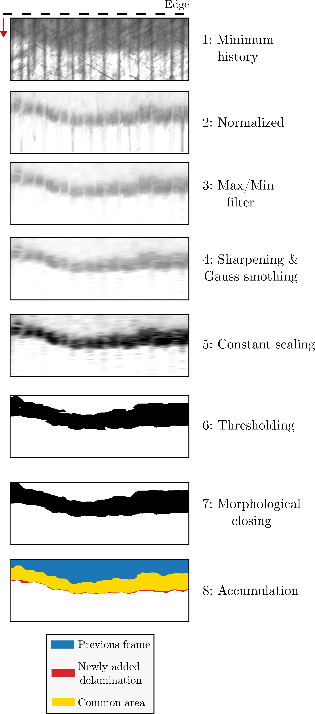

Delamination Detection Methodology
==================================

Edge and diffuse delamination are both reached through a single
:class:`~deladect.detection.delamination.DelaminationDetector` per
``(specimen, interface)`` pair. Then two other detectors are available inside
the same object, for the two delamination modes:
``detector.edge`` and
``detector.diffuse``.

Detection modes
---------------

DelaDect distinguishes two delamination modes, each documented on its own page:

.. grid:: 1 2 3 3
   :gutter: 2

   .. grid-item-card:: Edge delamination
      :link: edge_delamination
      :link-type: doc

      Damage connected to a specimen free edge: directional reconstruction
      and frame-to-frame latching.

   .. grid-item-card:: Diffuse delamination
      :link: diffuse_delamination
      :link-type: doc

      Damage sought locally around tracked transverse cracks, using a
      per-crack baseline to isolate new darkening.

   .. grid-item-card:: Multi-interface delamination
      :link: multi_interface_delamination
      :link-type: doc

      Attributing later damage to the correct, deeper interface in
      laminates with more than two plies. Edge-only.

.. toctree::
   :maxdepth: 1
   :hidden:

   edge_delamination
   diffuse_delamination
   multi_interface_delamination

Detection sequence
-------------------

Edge and diffuse delamination target different features (a connected front
vs. localized regions around cracks), but both are built on the same common
backbone, applied per frame:

1. **Minimum history** -- a cumulative minimum over the stack so intensity
   only ever decreases, filtering out transient bright noise (flashes,
   sensor noise).
2. **Normalization** -- divide by a reference frame so intensity change
   reflects damage, not lighting drift.
3. **Max/min filtering** -- morphological closing that suppresses thin
   crack-like structures while preserving broader delamination regions.
4. **Sharpening & Gaussian smoothing** -- widen the contrast between
   delaminated and intact regions, then smooth out noise.
5. **Constant scaling** -- map intensities to a fixed range so thresholding
   behaves consistently across frames.
6. **Thresholding** -- k-means (with Otsu as a fallback) turns the processed
   frame into a binary candidate mask.
7. **Morphological closing** -- fills small holes and bridges narrow gaps
   left by thresholding.
8. **Accumulation** -- union with the previous frame's mask, so detected
   damage only grows and single-frame flicker is rejected.

   The eight-step backbone applied to one edge-delamination example. Steps
   1-5 are intensity-domain filtering; 6-7 binarize and clean up the mask;
   8 accumulates it against the previous frame (blue = previous frame, red =
   newly added delamination, yellow = common area).

This same sequence runs for every delamination detection in DelaDect --
edge or diffuse, single- or multi-interface -- only the region each step
operates on differs (the whole frame for edge delamination, a rotated ROI
around each crack for diffuse). Steps 1-2 are covered in detail on the
:doc:`Image_pre_processing` page; steps 3-7 are shown pixel-by-pixel on
:doc:`image_operations`; and the full per-mode sequence, including free-edge
reconstruction and frame-to-frame latching, is in :doc:`edge_delamination`
and :doc:`diffuse_delamination`.

Combining the two
------------------

:meth:`~deladect.detection.delamination.DelaminationDetector.detect_both_delaminations`
runs both pipelines together and resolves any overlap
between the two modes favouring the edge delamination.

See also
--------

- :doc:`detection` for the callable API and default parameter values.
- :doc:`image_operations` for the pixel-scale filtering steps behind edge detection.
