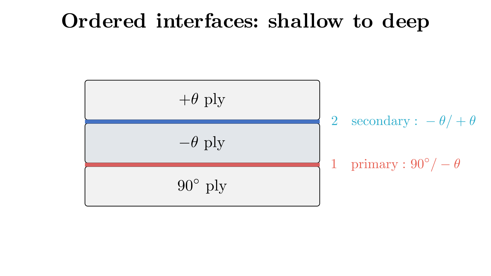
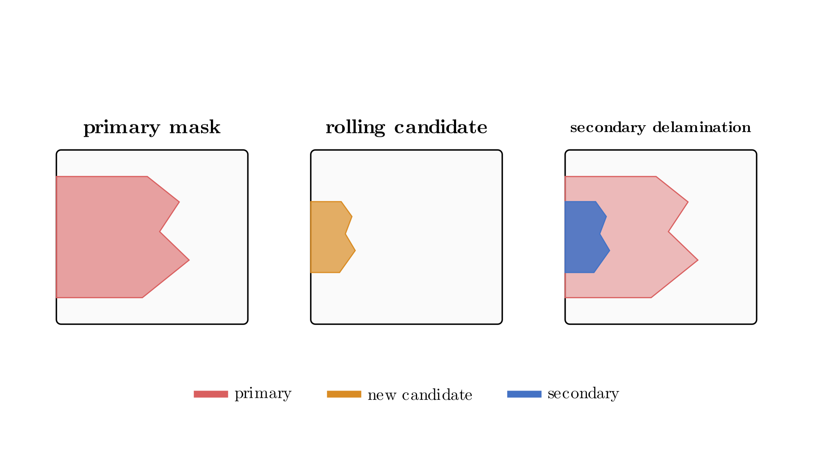

Multi-Interface Delamination
=============================

Everything on the :doc:`edge_delamination` and :doc:`diffuse_delamination`
pages detects damage at a single interface. In a laminate with more than two
plies, delamination can also develop at more than one interface over the
course of a test -- and DelaDect can attribute later damage to the correct,
deeper interface instead of lumping everything into the first one detected.
This capability is edge-only: it is not available for diffuse delamination.

Why interfaces need to be ordered
----------------------------------

Consider a symmetric laminate such as ``[+θ/-θ/90]_s``. From a single
frame, DelaDect only sees a distribution of pixel intensity -- there is no
way to tell, from one image alone, which physical interface a dark region
belongs to. What *does* carry that information is the sequence of frames: if
damage tends to appear at one interface first and only later spreads to a
deeper one, then watching *where new darkening shows up relative to what is
already damaged* is enough to tell the interfaces apart.

That is the idea behind multi-interface delamination: interfaces are given an
explicit shallow-to-deep order, the first (primary) interface is detected
exactly as in :doc:`edge_delamination`, and later darkening is tested inside
an already established primary region.

   The interface order is specimen knowledge supplied to DelaDect. It cannot
   be inferred from the intensity distribution in one image.

.. note::

   This relies on an assumption the algorithm does not verify: that damage
   at a given interface generally appears before damage at the next interface
   in the supplied order. This is often the case for laminates such as
   :math:`[\pm \theta /90^\circ]_s` with one interface dominant in the
   initial stages of a mechanical test, but it is a property of the
   specimen and loading, not something DelaDect checks for you.

:meth:`~deladect.detection.delamination.EdgeDetector.detect_edge_multi`
extends the same primary edge algorithm from :doc:`edge_delamination` to an
ordered interface list of any length. The first (primary) interface
accumulates exactly as described on that page. Each deeper interface is
attributed recursively: a pixel only becomes damage at level *n* once it is
both (a) classified in the secondary pass and (b) already covered by the
delayed mask established at level *n-1* -- level 2 gated by level 1, level 3
by level 2, and so on.

.. note:: One shared secondary-detection source across all deeper levels

   ``secondary_cache_paths`` (and ``secondary_edge_params``/
   ``secondary_params``) supply a single detection source and parameter set
   used for the classification pass at *every* level beyond the primary --
   there is no way to give the 3rd interface a different secondary cache or
   parameters than the 2nd. Only the gating chain (which established mask a
   candidate must fall inside) goes deeper per level; the underlying
   candidate signal does not.

Why two preprocessing caches
------------------------------

``detect_edge_multi`` accepts ``processed_cache_paths`` for the primary
accumulation and an optional, separate ``secondary_cache_paths`` for the
deeper-interface check:

- The primary pass should use a **static**-reference cache, matching
  :meth:`~deladect.detection.delamination.EdgeDetector.detect_primary` and
  ``detect_both_delaminations``, so the shallow interface's result is
  identical across the two entry points.
- The deeper-interface pass needs a **rolling-median**-reference cache
  instead. A static reference stops highlighting change once a region has
  already darkened, but this check specifically needs to detect *further*
  change happening inside an area the primary pass has already flagged. A
  rolling reference stays sensitive to that interior change. See
  :doc:`Image_pre_processing` for why a static reference falls short here.

If ``secondary_cache_paths`` is omitted, the primary pass's own binary/mask
output is reused for the deeper-interface check, which works but is less
sensitive to damage that develops after the primary front has already passed
over a region.

How a candidate is attributed to a deeper interface
------------------------------------------------------

For each frame and each deeper level, the algorithm:

1. Takes the secondary binary mask for that frame (from the rolling-median
   cache pass, or the primary pass if no separate cache was given). This
   mask is the same for every level -- see the note above.
2. Intersects it with the *parent* level's latched mask (the primary mask
   for level 1, the previous level's own accumulated mask for level 2 and
   deeper), read back ``reference_window`` frames earlier (the same window
   used for the rolling-median reference) -- an already-settled parent
   region rather than its still-growing edge.
3. Keeps only pixels still connected to the free edge.
4. OR-accumulates the result into that level's running mask, the same
   frame-to-frame latching used by the primary pass.

   Attribution at any depth. A rolling-reference candidate is eligible for a
   given interface only inside the settled, delayed mask of the interface
   directly above it; the intersection must remain connected to the specimen
   edge and is then latched over time.

``secondary_start_frame`` gates this off entirely: frames before the given
index produce no secondary output for that level, which is useful when
a specimen has a known dwell period before deeper damage can physically
occur.

``secondary_similarity_threshold`` and ``min_primary_frac_for_secondary`` are
accepted and validated but are not currently consulted by the attribution
computation above -- ``secondary_similarity_threshold`` is only echoed back
in the returned ``params`` dict, and the primary-area-fraction gate implied
by ``min_primary_frac_for_secondary`` is computed but not yet wired into the
per-frame decision. Do not rely on either to change output; the effective
controls are ``secondary_start_frame`` and the reference-window delay
described above.

See :doc:`examples/delamination_multi_interface` for a runnable script and
notebook, and :doc:`detection` for the full API.
