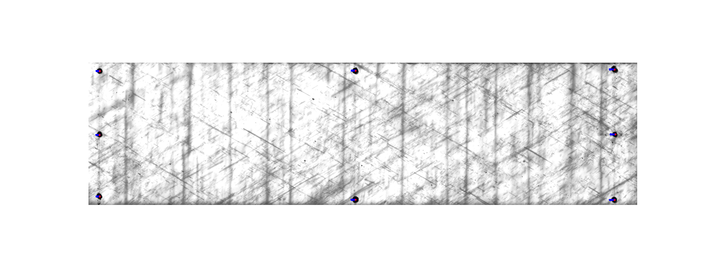

Shift Correction GUI
====================

Accurate crack and delamination detection starts with well-aligned image
sequences. DelaDect ships a lightweight Tkinter GUI, installed as the
``shift_correction`` console command, that corrects marker-based shift
distortion before frames reach the rest of the pipeline.

Introduction
------------
Inside the `CrackDect <https://github.com/mattdrvo/CrackDect>`_ package, a
shift-distortion correction procedure is already provided; more about that
approach can be found `here <https://crackdect.readthedocs.io/en/latest/shift_correction.html>`_.
However, it has some limitations for static testing and was deemed unreliable
for DelaDect's own test results (it may still be sufficient for your
experimental data).

The GUI described on this page addresses those limitations and is intended as
an auxiliary tool to DelaDect. Use it whenever raw footage shows translational
drift or camera jitter that would otherwise produce false crack or
delamination detections.

Requirements
------------
The Python dependencies below are installed automatically alongside
DelaDect:

- `matplotlib <https://pypi.org/project/matplotlib/>`_ >= 3.7.2
- `numpy <https://pypi.org/project/numpy/>`_ >= 1.24.3
- `Pillow <https://pypi.org/project/pillow/>`_ >= 9.4.0
- `scipy <https://pypi.org/project/scipy/>`_ >= 1.11.1
- `scikit-image <https://scikit-image.org/>`_ >= 0.20

Additionally:

- Figures need to be already cut, with the markers clearly visible.
- All the figures for a given run must live in the same folder.

How to Use
----------
1. **Prepare the images.** Make sure all pictures for the sequence are in a
   single folder:

   .. image:: _static/shift_correction/images_folder.png
      :alt: Folder containing the raw image sequence
      :width: 600
      :align: center

2. **Launch the GUI.** From an environment where DelaDect is installed, run:

   .. code-block:: bash

      shift_correction

   Alternatively, run the module directly from the source tree:

   .. code-block:: bash

      python -m deladect.cli.shift_correction

3. **Open the first image.** With the Shift Correction GUI open, go to
   ``File -> Open First Image`` and select the first frame of the series:

   .. image:: _static/shift_correction/app.png
      :alt: Shift Correction GUI main window
      :width: 720
      :align: center

4. **Set the output folder.** Choose where the shift-corrected images should
   be written via ``File -> Save Images In``.

5. **Mark the points.** Click each marker using ``Ctrl + Left Click``
   (``Command + Left Click`` on macOS). Aim for the center of each marker; a
   misplaced point can be removed with ``Shift + Left Click``:

   .. image:: _static/shift_correction/selection.png
      :alt: Marker point selection in the GUI
      :width: 720
      :align: center

6. **Run the correction.** Trigger ``File -> Perform Shift Correction`` and
   monitor the console for progress.

Commands
--------
The shortcuts depend on the operating system, but most actions are shared:

**Windows/Linux**

- Add a point: ``Ctrl + Left Click``

**macOS**

- Add a point: ``Command + Left Click``

**Common commands**

- Pan the figure: ``Left Click``
- Zoom in or out: ``Mouse Wheel``
- Delete a point: ``Shift + Left Click``

Outputs
-------
The application writes shift-corrected frames to the selected output folder.
It also produces diagnostic plots of the tracked points so you can verify
that the correct markers are being followed on every image:

Typical output structure:

- ``<output>/<specimen>/shift_corrected/*.bmp``
- ``<output>/<specimen>/plots/*.png`` (when plotting is enabled)
- ``<output>/<specimen>/strain_data.csv`` (when strain evaluation is enabled)

Fine-tuning
-----------
The GUI exposes several processing parameters to adjust marker detection and
tracking:

- **Step size (``n``)**: number of images to skip during evaluation. With
  ``n = 1`` every image is processed; with ``n = 2`` only every second image
  is considered, and so on.
- **Threshold value**: the maximum pixel intensity treated as "black" in the
  grayscale image, which drives marker detection. Lower values focus on
  darker pixels but may fail to detect markers if set too low; higher values
  include more pixels but risk detecting spurious points if set too high. A
  good starting point is **10-30** for very dark markers, though lighting
  conditions can shift this considerably.
- **Gaussian filter**: smooths the image, which helps when markers are
  poorly defined and multiple points are detected per marker. A recommended
  range is **1-5**.
- **Median filter**: averages out local inconsistencies inside a marker,
  improving point detection accuracy.

These suggested values work well for the example images above, but should be
tuned for your own data.

Integrating with DelaDect
--------------------------
Point your :class:`~deladect.specimen.Specimen` paths (``path_full``,
``path_middle``, etc.) to the shift-corrected output folders and continue
with the workflows described in :doc:`examples/getting_started` and
:doc:`detection`.
