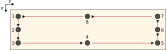

Shift Correction
================

Introduction
------------
The first step in any evaluation, whether for crack or delamination detection, 
is to ensure that the image sequence is properly aligned. A properly aligned 
sequence means that the same physical point on the specimen appears at the same 
pixel coordinates in every frame.

During mechanical testing, local deformation and strain cause the specimen to move relative to the camera. 
As a result, cracks or delaminations may appear to shift between consecutive images, 
even though they remain at the same physical location on the specimen. 
If left uncorrected, this apparent motion can lead to false detections.

.. image:: _static/shift_correction/l1_cut_images_sequence.gif
   :alt: Raw cut-image sequence from the L1 specimen
   :width: 960
   :align: center

.. image:: _static/shift_correction/l1_shift_correction.gif
   :alt: Real shift-correction example with tracked markers and mesh
   :width: 960
   :align: center

DelaDect ships a GUI, installed as the
``shift_correction`` console command, that performs shift
distortion correction for a sequence of frames.

Required:

- Specimen image needs to be oriented horizontally with the load direction also horizontal.
- Figures need to be already cut, with the markers clearly visible.
- All the figures for a given run must live in the same folder.

.. warning::
   All images in a run **must share the same dimensions**. Loading a folder
   with mismatched image sizes (width and height) raises an error before any correction is
   attempted. 

   Marker detection assumes **dark markers on a lighter background**. If your markers are
   lighther than the background no points will be detected.

How to Use
----------
1. **Prepare the images.** Make sure all pictures for the sequence are in a
   single folder;

2. **Launch the GUI.** From an environment where DelaDect is installed, run:

   .. code-block:: bash

      shift_correction

   Alternatively, run the module directly from the source tree:

   .. code-block:: bash

      python -m deladect.cli.shift_correction

3. **Open the first image.** With Shift Correction open, go to
   ``File -> Open First Image`` and select the first frame of the series:

   .. image:: _static/shift_correction/app.png
      :alt: Shift Correction main window
      :width: 720
      :align: center

4. **Set the output folder.** Choose where the shift-corrected images should
   be written via ``File -> Save Images In``.

5. **Mark the points.** Click each marker using ``Ctrl + Left Click``
   (``Command + Left Click`` on macOS). Aim for the center of each marker; a
   misplaced point can be removed with ``Shift + Left Click``:

   .. image:: _static/shift_correction/selection.png
      :alt: Marker point selection in the GUI
      :width: 720
      :align: center

   .. warning::
      Use **at least 4 markers**, and avoid placing any marker within a few
      pixels of the image border.

6. **Run the correction.** Trigger ``File -> Perform Shift Correction`` and
   monitor the console for progress.

Commands
--------
The shortcuts depend on the operating system, but most actions are shared:

**Windows/Linux**

- Add a point: ``Ctrl + Left Click``

**macOS**

- Add a point: ``Command + Left Click``

**Common commands**

- Pan the figure: ``Left Click``
- Zoom in or out: ``Mouse Wheel``
- Delete a point: ``Shift + Left Click``

Strain evaluation
-----------------
The tool also includes a very simple strain evaluation, which is only available 
when **exactly 4 or 8 markers** are selected. 
The strain is computed from the tracked marker coordinates 
and written to a CSV file in the output folder. 

The strain values are expressed in the local coordinate system defined by the markers,
with the origin at the top-left marker.

The strain evaluation is computed based on the detected distances between the markers,
according to the following expressions:

   Marker numbering/order used for strain evaluation.

For a pair of markers :math:`i, j`, let :math:`x` be the vertical (column)
pixel coordinate and :math:`y` the horizontal (row) pixel coordinate. Each
segment length is measured in the reference frame (:math:`L^{(0)}`) and in
the current frame (:math:`L^{(n)}`), and the engineering strain is computed
based on the following expression:

.. math::

   \varepsilon_{ij} = \frac{L_{ij}^{(n)} - L_{ij}^{(0)}}{L_{ij}^{(0)}}

**Longitudinal strain** (:math:`\varepsilon_y`, along the horizontal loading
direction) uses horizontal distances between markers on the top and bottom
edges:

.. math::

   L_{ij}^{\,\text{longitudinal}} = \left| x_i - x_j \right|

**Transverse strain** (:math:`\varepsilon_x`, perpendicular to loading) uses
vertical distances between markers on the left and right edges:

.. math::

   L_{ij}^{\,\text{transverse}} = \left| y_i - y_j \right|

The reported :math:`\varepsilon_x`/:math:`\varepsilon_y` for a frame is the
average of :math:`\varepsilon_{ij}` over its valid segments. 

Outputs
-------
The application writes shift-corrected frames to the selected output folder.
It also creates a tracking folder with the detected marker coordinates for each
frame. Here it is possible to check if the marker was properly detected. If the marker
is improperly detected, it is likely that the shift correction was unsuccessful. 

.. note::
   A marker that goes undetected or unmatched in a frame is dropped for
   that frame only, not permanently: on the next frame it is re-guessed
   from how the *other* markers moved, and re-attached if a real point is
   found near that guess. The longer a marker stays missing, the less
   reliable that guess becomes, since it is no longer based on the
   marker's own motion. If results look off, check the tracking output.

.. warning::
   Between two consecutive processed frames, a marker is only matched if
   it moved less than a fixed search radius (10 px by default). If the specimen
   moves quickly relative to the frame rate, the matching marker can be outside
   of the search radius. In this case, the search radius can be increased in the GUI's settings.

How it works
------------
More information about the shift correction can be found
`here <https://crackdect.readthedocs.io/en/latest/shift_correction.html>`_.
The current implementation estimates a displacement field from the
tracked marker coordinates using :class:`scipy.interpolate.RBFInterpolator`
with a thin-plate-spline kernel. In practise, based on the for marker positions
:math:`\mathbf{x}_i^{(0)}` in the reference image and
:math:`\mathbf{x}_i^{(n)}` in a later frame, the interpolator constructs a
warp function:math:`T(\mathbf{x})` such that
:math:`T(\mathbf{x}_i^{(0)}) \approx \mathbf{x}_i^{(n)}`. This transformation is shown
below.

.. image:: _static/shift_correction/rbf_interpolator_warp.gif
   :alt: RBFInterpolator warping a synthetic image from an initial to a final point layout
   :width: 960
   :align: center

.. _shift_correction_fine_tuning:

Settings
-----------
The GUI exposes several processing parameters to adjust marker detection and
tracking:

- **Step size (``n``)**: number of images to skip during evaluation. With
  ``n = 1`` every image is processed; with ``n = 2`` only every second image
  is considered, and so on.
- **Threshold value**: the maximum pixel intensity treated as "black" in the
  grayscale image, which drives marker detection. Lower values focus on
  darker pixels but may fail to detect markers if set too low; higher values
  include more pixels but risk detecting spurious points if set too high. A
  good starting point is **10-30** for very dark markers, though lighting
  conditions can shift this considerably.
- **Gaussian filter**: smooths the image, which helps when markers are
  poorly defined and multiple points are detected per marker. A recommended
  range is **1-5**.
- **Median filter**: averages out local inconsistencies inside a marker,
  improving point detection accuracy.

These default values work well for the example images above, but should be
tuned for your own data.